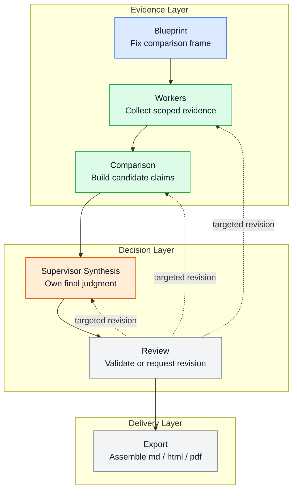
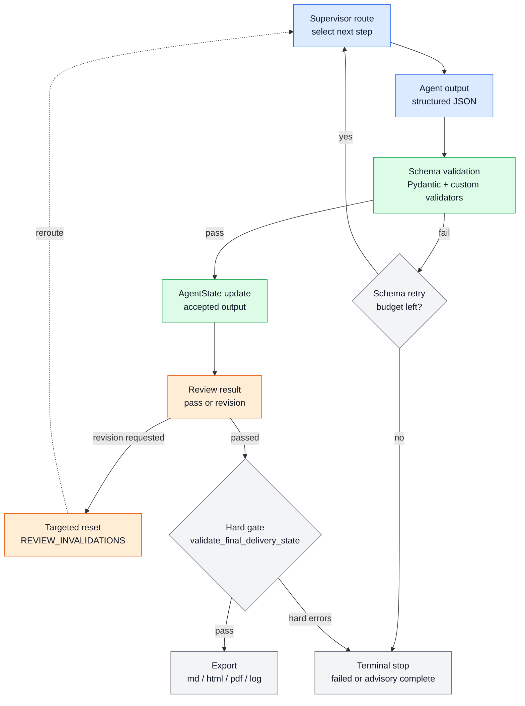

# Agentic RAG Battery Strategy Evaluator

LG에너지솔루션(LGES)과 CATL의 포트폴리오 다각화 전략을 근거 기반으로 비교 분석하기 위한 Agentic RAG 프로젝트입니다. 공식 PDF 문서를 FAISS로 인덱싱해 retrieval evidence를 확보하고, Supervisor 패턴 Multi-Agent 워크플로우로 시장 배경 · 기업별 전략 · 정량 비교 · SWOT · 점수화 · 최종 판단까지 자동으로 조립해 Markdown / HTML / PDF 보고서를 생성합니다.

> 단순 기업 소개가 아니라, 비교 축을 먼저 고정하고 근거를 단계별로 축적한 뒤 최종 판단까지 도출하는 파이프라인입니다.

---

## Overview

배터리 산업 비교 분석은 기업마다 지역 전략 · 제품 포트폴리오 · ESS 확장 방향 · 비용 구조 · 리스크 노출도 · 기술 로드맵이 달라, 동일 기준을 먼저 고정하지 않으면 결론이 왜곡되기 쉽습니다.

이 프로젝트는 `Supervisor Blueprint → Worker Evidence → Supervisor Synthesis → Review → Report Assembly` 순서로 책임을 분리해 이 문제를 해결합니다.

| 항목 | 내용 |
|-----|-----|
| 목표 | LGES와 CATL의 다각화 전략을 동일 기준으로 비교 분석 |
| 방식 | Supervisor 패턴 Multi-Agent + Agentic RAG |
| 입력 | PDF 문서셋, `document_manifest.json`, `.env` |
| 출력 | 전략 비교 보고서 (`.md` / `.html` / `.pdf`) 및 실행 로그 (`.log`) |
| 핵심 판단 요소 | 시장 배경, 전략 차이, 정량 비교, SWOT, 점수 근거, 최종 판단 |

---

## Architecture

### Architecture in One View



이 저장소의 핵심은 agent 수가 아니라 `비교 축을 먼저 고정하고`, `근거를 단계별로 축적하고`, `최종 판단 ownership을 Supervisor에 고정하는 제어 구조`입니다.

- `Blueprint`가 비교 프레임과 worker contract를 먼저 고정합니다.
- `Workers`는 retrieval 기반 evidence와 normalized metric만 생산합니다.
- `Comparison`은 candidate claim만 만들고 최종 결론은 쓰지 않습니다.
- `Supervisor Synthesis`만 executive summary, SWOT, final judgment를 작성합니다.
- `Review`는 제출 계약을 감리하고 필요한 단계로만 되돌립니다.

---

### Core Design Rules

이 프로젝트는 Router나 단순 Distributor보다 `Supervisor pattern`이 더 적합합니다. 이유는 세 가지입니다.

- `비교 축 통제`: `supervisor_blueprint`가 비교 축 4개를 먼저 고정합니다.
- `output ownership 분리`: worker는 fact/evidence packet만 만들고, 최종 판단은 `supervisor_synthesis`만 작성합니다.
- `revision loop 제어`: review 실패 시 전체 재실행이 아니라 필요한 단계만 다시 돌립니다.

이 시스템의 목표는 문장을 많이 생성하는 것이 아니라, **근거를 잃지 않은 채 비교 판단까지 가는 파이프라인**을 만드는 것입니다.

---

### Stage Responsibilities

| Stage | Reads | Owns / Writes | Must Not Do |
|------|-------|---------------|-------------|
| `supervisor_blueprint` | `goal`, `target_companies`, `source_documents` | `report_blueprint` | 최종 보고서 문장, `final_judgment` 작성 |
| `market_research` | `report_blueprint`, market retrieval hits | `market_facts`, `market_context`, `market_context_summary` | `executive_summary`, `final_judgment` 작성 |
| `lges_analysis` | `report_blueprint`, `market_context_summary`, LGES retrieval hits | `lges_facts`, `lges_profile`, `lges_normalized_metrics`, `profitability_reported_rows` | 최종 판단 작성, CATL scope 침범 |
| `catl_analysis` | `report_blueprint`, `market_context_summary`, CATL retrieval hits | `catl_facts`, `catl_profile`, `catl_normalized_metrics`, `profitability_reported_rows` | 최종 판단 작성, LGES scope 침범 |
| `comparison` | fact layer, normalized metrics | `comparison_input_spec`, `synthesis_claims`, `score_criteria`, `metric_comparison_rows`, `low_confidence_claims` | 새 retrieval 실행, `final_judgment` 작성 |
| `supervisor_synthesis` | blueprint + fact layer + comparison layer | `selected_comparison_rows`, `reference_only_rows`, `executive_summary`, `supervisor_swot`, `supervisor_score_rationales`, `final_judgment`, `implications`, `limitations` | worker evidence 재생성, 원문 재검색 |
| `review` | `report_spec`, `validation_warnings`, `low_confidence_claims` | `review_result`, `review_issues` | 새로운 사업 판단, 임의 수치 생성 |
| `reporting / export` | 최종 state | `.md`, `.html`, `.pdf`, `.log` | 미검증 state 직접 export |

`forbidden_outputs`는 단순 컨벤션이 아닙니다. `ReportBlueprint`의 `model_validator`가 각 `WorkerTaskSpec.forbidden_outputs`에 `final_judgment`, `executive_summary`, `final_swot`, `final_score_rationale`이 포함되는지 강제 검증합니다.

---

### Execution Flow

이 프로젝트는 LangGraph의 선언형 `StateGraph.compile()` 대신 `graph.py`의 `run_once()`가 `supervisor_agent(state)` → `AGENT_REGISTRY[step](state)`를 직접 실행하는 **수동 supervisor loop**를 사용합니다.

```text
app.py main()
  └─ for _ in range(MAX_WORKFLOW_ITERATIONS):
        state = run_once(state)
          ├─ supervisor_agent(state)     # 다음 step 결정
          └─ AGENT_REGISTRY[step](state) # 해당 agent 실행
```

`supervisor_agent()`는 `AgentState`를 읽고 아래 순서로 라우팅합니다.

1. 실패 상태면 schema retry 예산을 확인하고 현재 step을 재시도하거나 종료합니다.
2. review가 실패했으면 `revision_target`으로 되돌립니다.
3. `report_blueprint`가 없으면 `supervisor_blueprint`를 실행합니다.
4. `market_context`가 없으면 `market_research`를 실행합니다.
5. `lges_profile`, `catl_profile`이 없으면 각 회사 분석을 실행합니다.
6. `synthesis_claims` 또는 `metric_comparison_rows`가 없으면 `comparison`을 실행합니다.
7. supervisor-owned sections가 비어 있으면 `supervisor_synthesis`를 실행합니다.
8. `review_result`가 없으면 `review`를 실행합니다.
9. 모든 조건이 충족되면 `finish`로 이동하고 export gate를 통과한 뒤 산출물을 생성합니다.

이 수동 루프를 택한 이유는 `REVIEW_INVALIDATIONS`, schema retry, review retry, revision target별 state 복구를 세밀하게 제어하기 위해서입니다.

---

### Review and Retry

review와 schema validation은 같은 실패가 아닙니다. 이 저장소는 이를 별도 budget과 reset 정책으로 분리합니다.

- `schema retry`: 특정 agent 출력이 schema/validator 검증에 실패했을 때 같은 step을 다시 실행합니다.
- `review retry`: 보고서 계약 감리에서 문제가 발견되면 `revision_target`으로만 되돌립니다.
- `REVIEW_INVALIDATIONS`: revision target 이후의 downstream field만 비우고 이전 evidence는 유지합니다.
- `schema_retry_count`와 `review_retry_count`는 독립적으로 관리되며, revision이 발생하면 `schema_retry_count`는 0으로 리셋됩니다.

`RetryBudget`는 `schema_validation_max`와 `review_max`를 분리해 관리합니다. review가 되돌릴 수 있는 핵심 target은 `market_research`, `lges_analysis`, `catl_analysis`, `comparison`, `supervisor_synthesis`입니다.

예를 들어 review가 `comparison`으로 revision을 요청하면 `market_facts`, `lges_facts`, `catl_facts`는 유지되고, `comparison_input_spec` 이후 필드만 초기화됩니다. 이렇게 해서 비용이 큰 retrieval과 extraction을 반복하지 않습니다.

```text
REVIEW_INVALIDATIONS["comparison"] = (
    "comparison_input_spec", "synthesis_claims", "score_criteria",
    "metric_comparison_rows", "comparability_decisions",
    "selected_comparison_rows", "reference_only_rows",
    "chart_selection", "executive_summary", "company_strategy_summaries",
    "quick_comparison_panel", "supervisor_swot", "supervisor_score_rationales",
    "final_judgment", "implications", "limitations",
    "review_result", "review_issues",
)
```

---

### State Layers

`AgentState`는 공용 인터페이스이며, 핵심 필드는 5개 레이어로 관리됩니다.

| Layer | Representative Fields | Owner / Purpose |
|------|------------------------|-----------------|
| Blueprint | `report_blueprint` | 비교 축 4개, comparability precheck, worker contract 고정 |
| Fact | `market_facts`, `market_context`, `lges_facts`, `lges_profile`, `catl_facts`, `catl_profile`, `citation_refs` | worker가 scope별 evidence packet 생성 |
| Comparison | `comparison_input_spec`, `synthesis_claims`, `score_criteria`, `metric_comparison_rows`, `low_confidence_claims` | supervisor synthesis용 candidate evidence 구성 |
| Supervisor-Owned Report | `selected_comparison_rows`, `reference_only_rows`, `executive_summary`, `supervisor_swot`, `supervisor_score_rationales`, `final_judgment`, `report_spec` | 최종 보고서 핵심 내용과 제출 계약 조립 |
| Review / Governance | `review_result`, `review_issues`, `validation_warnings`, `schema_retry_count`, `review_retry_count`, `status`, `last_error` | 재시도, 감리, 종료 상태 관리 |

artifact 상태는 export 이후 `report_artifacts`, `execution_log`로 별도 추적됩니다.

중요한 state contract는 다음과 같습니다.

- `ReportBlueprint`는 comparison axes 순서와 worker task spec completeness를 검증합니다.
- `FactExtractionOutput`은 claim scope alignment를 검증해 LGES/CATL 오염을 막습니다.
- `comparison` 레이어는 `ComparisonInputSpec.allowed_claim_ids()` 범위 밖 claim을 허용하지 않습니다.
- `report_spec`은 제출 계약 객체이며 claim ID 중복과 필수 section 누락을 차단합니다.

---

### Validation and Delivery Gate

아래 다이어그램은 agent 출력이 schema validation, retry, review, export gate를 거치는 제어 흐름을 보여줍니다.



`tools/validation.py`는 두 단계의 검증을 수행합니다.

| Validation Type | 역할 | 예시 규칙 |
|-----------------|------|-----------|
| Hard Gate | export 차단 | `required-section-missing`, `required-chart-missing`, `synthesis-support-count`, `score-criterion-evidence`, `supporting-claim-origin`, `fact-claim-evidence` |
| Soft Gate | 경고만 기록 | summary/final judgment 중복, 수치 없는 범용 표현, basis 설명 누락, 반복 score rationale, raw metric만 나열한 SWOT |

또한 comparison 단계와 delivery 단계에는 아래 제약이 있습니다.

- `comparison`은 새 retrieval 없이 `ComparisonInputSpec` claim catalog만 사용합니다.
- `SynthesisClaim.supporting_claim_ids`는 최소 2개여야 합니다.
- `ScoreCriterion.evidence_refs`는 materialized field로 유지되어야 합니다.
- hard gate를 통과하지 못한 결과는 `.md`, `.html`, `.pdf`로 export되지 않습니다.

---

### Detailed Notes

#### Evidence and Comparison Flow

이 프로젝트의 RAG는 웹 검색 대체물이 아니라 **공식 문서 기반 evidence layer**입니다.

1. `tools.preprocessing`이 PDF를 청킹해 `data/processed/corpus.jsonl`을 만듭니다.
2. `tools.retrieval`이 embedding과 FAISS index를 생성합니다.
3. worker agent가 scope별 retrieval query를 실행해 `EvidenceRef`를 수집합니다.
4. fact extraction이 structured claim과 `evidence_refs`를 생성합니다.
5. `tools.normalization`이 metric claim을 `NormalizedMetric`으로 변환합니다.
6. `tools.comparison_contract`가 fact layer를 `ComparisonInputSpec`으로 압축합니다.
7. `comparison`은 candidate synthesis claims와 score criteria만 생성합니다.
8. `supervisor_synthesis`가 최종 보고서 섹션을 작성하고 `build_report_spec`이 제출 계약 객체를 조립합니다.

정량 비교는 `direct`, `reference_only`, `reject`로 분류됩니다. `direct`만 직접 비교표에 들어가고, `reference_only`는 별도 표로 분리됩니다.

#### Report Assembly

보고서 생성은 단순 텍스트 출력이 아니라 `state -> ReportSpec -> rendered artifacts` 경로를 거칩니다.

```text
supervisor_synthesis
  -> supervisor-owned state fields
  -> build_report_spec
  -> review
  -> validate_final_delivery_state
  -> assemble markdown / html / pdf
  -> write_execution_log
```

`tools.reporting`은 renderer이고, 내용 책임은 `supervisor_synthesis + review + final validation`에 있습니다.

<details>
<summary>Validator examples</summary>

`LGESFactExtractionOutput`과 `CATLFactExtractionOutput`은 required metric families를 강제합니다.

```python
LGES_REQUIRED_METRIC_FAMILIES = (
    "revenue_growth_guidance",
    "operating_margin_guidance_or_actual",
    "capex",
    "ess_capacity",
    "secured_order_volume",
)

CATL_REQUIRED_METRIC_FAMILIES = (
    "revenue",
    "gross_profit_margin",
    "net_profit_margin",
    "roe",
    "operating_cash_flow",
)
```

이 중 하나라도 없으면 `model_validate()` 시점에 `ValueError`가 발생하고 supervisor는 해당 step을 schema retry 대상으로 처리합니다.

</details>

<details>
<summary>Claim provenance and traceability</summary>

모든 claim은 `{scope}-{category}-{ordinal}` 형식의 결정론적 ID를 가집니다.

```text
"lges-capex-1"
"catl-gross_profit_margin-2"
```

최종 판단은 `FinalJudgment -> SynthesisClaim -> AtomicFactClaim / MetricFactClaim -> EvidenceRef -> DocumentRef` 경로로 역추적됩니다. `ReportSpec.model_validator`는 전체 claim ID 집합의 중복을 차단합니다.

</details>

<details>
<summary>SWOT and HITL notes</summary>

SWOT은 회사별 진단으로 유지하되, 시사점과 종합 판단은 `supervisor_synthesis`에서만 작성합니다. soft gate는 SWOT이 raw metric만 나열하고 전략 해석이 없으면 경고를 기록합니다.

현재 기본 워크플로우에는 HITL이 없지만, 확장한다면 `comparison` 직후와 `supervisor_synthesis` 직전이 가장 적절합니다. 이 경우에도 최종 output ownership은 Supervisor에 남아 있어야 합니다.

</details>

---

### Further Design Notes

- 설계 배경과 선택 근거는 [docs/design.md](./docs/design.md)에 보조 문서로 정리돼 있습니다.
- 실행 및 장애 대응은 [docs/runbook.md](./docs/runbook.md)를 기준으로 봅니다.
- draw.io 원본은 `docs/drawio/` 아래에 보관돼 있습니다.

---

## Decision Framework

최종 보고서의 점수와 판단은 아래 4개 기준으로 정리됩니다. 근거가 부족하면 추정하지 않고 `score: null`로 표기합니다.

| Criterion | 설명 |
|-----------|------|
| `portfolio_diversification` | EV 외 확장, 포트폴리오 폭, 전략 선택지 |
| `technology_product_strategy` | 기술 방향, 제품 다양성, R&D 투자 |
| `regional_supply_chain` | 지역 전략, 공급망 구성, 수요 대응력 |
| `financial_resilience` | 비용 구조, 수익성, 리스크 대응 여력 |

---

## Scoring Principles

- 각 기준은 `1~5점` 또는 `null` (정보 부족)로 표현합니다.
- 점수는 `ScoreCriterion.rationale` + `ScoreCriterion.evidence_refs`가 함께 존재해야 합니다.
- `evidence_refs`는 `supporting_claim_ids`에서 상속하지 않고 materialized field로 유지합니다.
- hard gate를 통과하지 못한 결과는 export되지 않습니다.

---

## Tech Stack

| Category | Details |
|----------|---------|
| Language | Python 3.11+ |
| LLM | OpenAI GPT-4.1-mini |
| Embedding | `intfloat/multilingual-e5-large` |
| Vector Search | FAISS |
| Schema / Validation | Pydantic v2 |
| PDF Processing | pypdf |
| Report Export | HTML + Playwright (Chromium) PDF |
| Test | pytest |
| Orchestration | 수동 supervisor loop (`graph.py`) |

---

## Project Structure

```text
.
├── app.py                          # 진입점: 전처리 → 워크플로우 루프 → export
├── graph.py                        # run_once(): supervisor → AGENT_REGISTRY[step] 수동 루프
├── state.py                        # AgentState TypedDict + 모든 Pydantic 모델
├── config.py                       # 환경변수 로드 및 경로 설정
├── requirements.txt
├── .env.example
├── agents/
│   ├── supervisor.py               # 라우팅 결정 + REVIEW_INVALIDATIONS
│   ├── supervisor_blueprint.py     # 비교 축 고정 + worker contract 정의
│   ├── market_research.py          # 시장 fact extraction
│   ├── lges_analysis.py            # LGES fact + normalization
│   ├── catl_analysis.py            # CATL fact + normalization
│   ├── comparison.py               # candidate evidence packet 생성
│   ├── supervisor_synthesis.py     # 최종 보고서 섹션 작성
│   ├── review.py                   # 제출 계약 감리
│   └── company_analysis.py         # 공통 분석 헬퍼
├── prompts/
│   ├── __init__.py
│   └── structured.py               # 구조화 출력 프롬프트 + guardrail
├── tools/
│   ├── preprocessing.py            # PDF 청킹 → corpus.jsonl
│   ├── retrieval.py                # embedding → FAISS 인덱스 준비
│   ├── normalization.py            # MetricFactClaim → NormalizedMetric
│   ├── comparison_contract.py      # fact layer → ComparisonInputSpec
│   ├── comparison_fallback.py      # comparison 실패 fallback 처리
│   ├── fact_conversion.py          # fact 변환 헬퍼
│   ├── fact_fallbacks.py           # fact extraction 실패 fallback
│   ├── charting.py                 # ChartSpec 생성 및 검증
│   ├── validation.py               # hard gate + soft gate
│   ├── reporting.py                # ReportSpec → Markdown / HTML / PDF
│   └── openai_client.py            # OpenAI 클라이언트 래퍼
├── data/
│   ├── document_manifest.json      # 문서 메타데이터 및 scope 정의
│   ├── document_manifest.example.json
│   ├── raw/                        # 원본 PDF
│   ├── processed/                  # chunked corpus + processed manifest
│   └── index/                      # FAISS 인덱스 + retrieval metadata
├── docs/
│   ├── design.md                   # 설계 근거 보조 문서
│   └── runbook.md                  # 실행 및 제출 운영 가이드
├── tests/
│   ├── fixtures/
│   ├── conftest.py
│   ├── test_schema_contracts.py    # ReportBlueprint validator + claim scope alignment
│   ├── test_comparison_contract.py # ComparisonInputSpec allowed_claim_ids 경계 검증
│   ├── test_fact_extraction_agents.py  # required metric families 충족 여부
│   ├── test_normalization.py       # NormalizedMetric 변환 정확성 + derived metric 마킹
│   ├── test_validation.py          # hard gate / soft gate 규칙 전체
│   ├── test_review_prompt.py       # review agent 판단 로직
│   ├── test_supervisor.py          # REVIEW_INVALIDATIONS + retry budget 소진 시나리오
│   ├── test_charting.py            # ChartSpec 생성 및 trend title 경고
│   ├── test_reporting.py           # ReportSpec → Markdown / HTML 렌더링
│   ├── test_app_e2e.py             # 전체 워크플로우 smoke test
│   └── test_acceptance_suite.py    # 제출 기준 acceptance 검증
├── outputs/                        # 최종 보고서 출력
└── logs/                           # JSONL 실행 로그
```

---

## Setup

### Requirements

- Python 3.11+
- OpenAI API key
- Playwright Chromium (PDF export용)

### 1. Install Dependencies

```bash
python3 -m venv .venv
.venv/bin/pip install -r requirements.txt
.venv/bin/python -m playwright install chromium
cp .env.example .env
```

### 2. Configure Environment Variables

`.env`에 아래 항목을 채웁니다.

```env
OPENAI_API_KEY=
OPENAI_MODEL=gpt-4.1-mini
OPENAI_TIMEOUT_SECONDS=60
OPENAI_MAX_OUTPUT_TOKENS=2000
EMBEDDING_MODEL=intfloat/multilingual-e5-large

DOCUMENT_MANIFEST_PATH=data/document_manifest.json
PROCESSED_MANIFEST_PATH=data/processed/document_manifest.processed.json
PROCESSED_CORPUS_PATH=data/processed/corpus.jsonl
FAISS_INDEX_PATH=data/index/faiss.index
RETRIEVAL_METADATA_PATH=data/index/faiss_metadata.jsonl
RETRIEVAL_MANIFEST_PATH=data/index/retrieval_manifest.json
OUTPUT_MARKDOWN_PATH=outputs/report.md
OUTPUT_HTML_PATH=outputs/report.html
OUTPUT_PDF_PATH=outputs/report.pdf
LOG_PATH=logs/app.log

PREPROCESS_CHUNK_SIZE=1200
PREPROCESS_CHUNK_OVERLAP=200
RETRIEVAL_TOP_K=6

MAX_SCHEMA_RETRIES=2
MAX_REVIEW_RETRIES=2
```

### 3. Prepare Documents

PDF 파일을 `data/raw/` 아래에 두고 `data/document_manifest.json`에 메타데이터를 작성합니다. 예시는 `data/document_manifest.example.json`을 참고하세요.

```json
{
  "document_id": "lges-ir-2024",
  "title": "LG Energy Solution IR Presentation 2024",
  "source_path": "data/raw/lges_ir_2024.pdf",
  "source_type": "presentation",
  "company_scope": "lges",
  "published_at": "2024-03",
  "page_range": "1-40"
}
```

`company_scope`는 `market` / `lges` / `catl` / `shared` 중 하나입니다. retrieval 단계에서 scope별 필터링에 사용됩니다.

### 4. Run

```bash
TOKENIZERS_PARALLELISM=false OMP_NUM_THREADS=1 .venv/bin/python app.py
```

### 5. Useful Commands

```bash
# 전처리만 실행
.venv/bin/python -m tools.preprocessing

# FAISS 인덱스만 재빌드
.venv/bin/python -m tools.retrieval

# 테스트
.venv/bin/pytest -q
```

---

## Outputs

| 파일 | 설명 |
|-----|-----|
| `outputs/report.md` | 제출용 Markdown 보고서 |
| `outputs/report.html` | 브라우저 검토용 HTML 보고서 |
| `outputs/report.pdf` | 공유/제출용 PDF (Playwright 렌더링) |
| `logs/app.log` | JSONL 실행 로그 — 단계별 step, status, routing_reason, attempt 기록 |

---

## Acceptance Coverage

| 범주 | 테스트 | 검증 내용 |
|-----|--------|---------|
| Schema / Contract | `test_schema_contracts.py`, `test_comparison_contract.py` | `ReportBlueprint` model_validator, claim scope alignment, `allowed_claim_ids` 경계 |
| Fact Extraction / Normalization | `test_fact_extraction_agents.py`, `test_normalization.py` | required metric families 충족, NormalizedMetric 변환, derived metric 마킹 |
| Validator / Review | `test_validation.py`, `test_review_prompt.py`, `test_supervisor.py` | hard gate 규칙 전체, soft gate 탐지 로직, REVIEW_INVALIDATIONS 동작, retry budget 소진 |
| Reporting / Charting | `test_reporting.py`, `test_charting.py` | ReportSpec → Markdown/HTML 렌더링, trend title 경고 |
| Workflow / Export E2E | `test_app_e2e.py`, `test_acceptance_suite.py` | 전체 워크플로우 smoke, 제출 기준 acceptance |

---

## Limitations

- 최신 정보 수집보다 공식 문서 기반 근거 일관성에 최적화돼 있습니다. 문서셋 품질이 결과 품질에 직접 영향을 줍니다.
- 기업별 공개 문서 분량과 범위가 다르면 비교 밀도가 달라질 수 있습니다.
- 정량 비교는 disclosed basis를 유지하므로, 서로 다른 회계 기준이나 기간은 완전 통합하지 않습니다.
- 이 시스템은 전략 검토 보조 도구이며 실제 투자나 사업 의사결정을 대체하지 않습니다.

---

## Notes

- 이 README가 현재 구현 기준의 아키텍처 source of truth입니다.
- 설계 배경과 선택 근거는 [docs/design.md](./docs/design.md)에 보조 문서로 정리돼 있습니다.
- 운영 및 장애 대응은 [docs/runbook.md](./docs/runbook.md)를 기준으로 봅니다.
