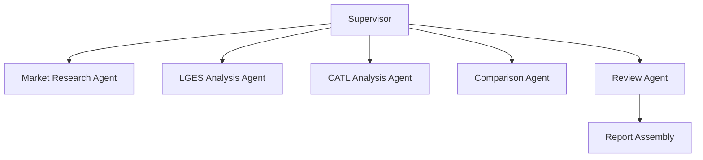

# Agentic RAG Battery Strategy Evaluator

LG에너지솔루션과 CATL의 포트폴리오 다각화 전략을 근거 기반으로 비교 분석하기 위한 LangGraph 기반 Agentic RAG 프로젝트입니다. 공식 PDF 문서와 구조화된 검색 근거를 함께 사용해 시장 배경, 기업별 전략, 정량 비교, SWOT, 점수화, 최종 판단까지 자동으로 조립하고 Markdown, HTML, PDF 보고서를 생성합니다.

> 단순 기업 소개가 아니라, 실제 전략 검토 문서 수준으로 비교 축을 맞추고 근거를 연결한 상태에서 최종 판단까지 도출하는 것을 목표로 합니다.

## Overview

배터리 산업 비교 분석은 한 기업씩 서술하는 방식으로는 의사결정에 바로 쓰기 어렵습니다. 같은 EV 배터리 기업이라도 지역 전략, 제품 포트폴리오, ESS 확장, 비용 구조, 리스크 노출도, 기술 방향이 다르고, 이를 동일 기준으로 맞춰 보지 않으면 결론이 쉽게 왜곡됩니다.

이 프로젝트는 이러한 문제를 해결하기 위해 `Agentic RAG + Supervisor 기반 Multi-Agent + 구조화 출력 검증` 방식을 사용합니다.

| 항목 | 내용 |
|-----|-----|
| 목표 | LGES와 CATL의 다각화 전략을 동일 기준으로 비교 분석 |
| 방식 | LangGraph 기반 Multi-Agent + Agentic RAG |
| 입력 | PDF 문서셋, 문서 manifest, 실행 환경 변수 |
| 출력 | 전략 비교 보고서 (`.md`, `.html`, `.pdf`) 및 실행 로그 (`.log`) |
| 핵심 판단 요소 | 시장 배경, 전략 차이, 정량 비교, SWOT, 점수 근거, 최종 판단 |

## Key Features

- 공식 PDF 문서 기반 전처리 및 청킹
- FAISS 기반 RAG 검색
- 시장 / LGES / CATL / 비교 / 리뷰 단계 분리
- 1차 fact extraction과 2차 comparison synthesis 분리
- 정량 metric normalization 및 profitability row 고정 매핑
- chart spec 기반 차트 생성
- hard gate / soft gate validator
- Markdown / HTML / PDF 보고서 생성
- reference 및 inline citation 자동 정리
- acceptance suite와 제출용 수동 체크리스트 포함

## Architecture

본 프로젝트는 Supervisor가 전체 상태를 읽고 다음 Agent를 선택하는 중앙 제어형 워크플로우입니다.



### Workflow Summary

1. `Market Research Agent`가 배터리 산업 시장 배경과 비교 축을 정리합니다.
2. `LGES Analysis Agent`가 LGES의 전략, 핵심 주장, 정량 근거를 추출합니다.
3. `CATL Analysis Agent`가 CATL의 전략, 핵심 주장, 정량 근거를 추출합니다.
4. 정량 claim은 normalization을 거쳐 비교 가능한 형태로 정리됩니다.
5. `Comparison Agent`가 1차 claim catalog만 사용해 synthesis, score criteria, metric comparison rows, chart spec을 생성합니다.
6. `Review Agent`가 근거 연결, 점수 근거, 결론 일관성, 레이아웃 필수 요소를 검토합니다.
7. 최종 상태가 hard gate를 통과하면 Markdown, HTML, PDF 보고서와 실행 로그를 생성합니다.

---

## RAG Pipeline

이 프로젝트의 RAG는 최신 웹 검색 대체물이 아니라, 배터리 산업과 기업 전략을 뒷받침하는 공식 문서 근거 레이어입니다.

### Pipeline Flow

1. 분석 대상 PDF를 `data/raw/`에 저장합니다.
2. 문서 메타데이터를 `data/document_manifest.json`으로 관리합니다.
3. 문서를 페이지 단위로 읽고 청킹합니다.
4. 청크 임베딩을 생성해 FAISS 인덱스를 구성합니다.
5. 각 Agent가 자신의 질문에 맞는 관련 청크를 검색합니다.
6. 검색된 근거를 기반으로 구조화 출력을 생성합니다.
7. 최종 판단과 점수는 claim, evidence, reference로 역추적 가능하게 유지합니다.

### RAG vs Structured Comparison

| 구분 | 역할 |
|-----|-----|
| RAG | 공식 문서 근거 검색, 시장/전략/리스크/정량 정보 추출 |
| Comparison Pass | 1차 pass에서 만든 claim catalog만 사용해 비교와 판단 생성 |

---

## Agent Roles

| Agent | 역할 | 주요 출력 |
|------|------|----------|
| Supervisor Agent | 다음 step 라우팅, 재시도, 종료 판단 | `current_step`, `status` |
| Market Research Agent | 시장 배경 및 비교 축 추출 | `market_facts`, `market_context` |
| LGES Analysis Agent | LGES 전략 및 정량 근거 추출 | `lges_facts`, `lges_profile`, `lges_normalized_metrics` |
| CATL Analysis Agent | CATL 전략 및 정량 근거 추출 | `catl_facts`, `catl_profile`, `catl_normalized_metrics` |
| Comparison Agent | synthesis, score criteria, 비교표, 차트 생성 | `synthesis_claims`, `score_criteria`, `metric_comparison_rows`, `charts` |
| Review Agent | 결론-근거 정합성 및 제출 가능성 검토 | `review_result`, `review_issues`, `validation_warnings` |

## Decision Framework

본 시스템은 최종 보고서에서 점수와 판단을 아래 관점으로 정리합니다. 점수와 결론은 항상 evidence 기반으로 작성되며, 근거가 부족하면 추정하지 않고 보수적으로 유지합니다.

| Criterion | 설명 |
|-----------|------|
| Diversification Strength | EV 외 확장, 포트폴리오 폭, 전략 선택지 |
| Cost Competitiveness | 비용 구조, 제조 경쟁력, 가격 압박 대응력 |
| Market Adaptability | 지역 전략, 제품 대응력, 수요 변화 대응 |
| Risk Exposure | 정책, 수요, 가격, 공급망, 실행 리스크 |

## Scoring Principles

- 각 score criterion은 `1~5점` 또는 `정보 부족(null)`로 표현합니다.
- 점수는 reasoning과 evidence refs가 함께 존재해야 합니다.
- `ScoreCriterion.evidence_refs`는 supporting claim에서 상속하지 않고 materialized field로 유지합니다.
- hard gate를 통과하지 못한 결과는 export되지 않습니다.

## Final Deliverables

| 파일 | 설명 |
|-----|-----|
| `outputs/report.md` | 제출용 Markdown 보고서 |
| `outputs/report.html` | 브라우저 검토용 HTML 보고서 |
| `outputs/report.pdf` | 공유/제출용 PDF 보고서 |
| `logs/app.log` | JSONL 실행 로그 |

## Tech Stack

| Category | Details |
|----------|---------|
| Language | Python 3.11+ |
| Framework | LangGraph, LangChain |
| LLM | OpenAI GPT-4.1-mini |
| Embedding | `intfloat/multilingual-e5-large` |
| Vector Search | FAISS |
| PDF Processing | `pypdf` |
| Validation | Pydantic v2 |
| Report Export | HTML + Playwright PDF |
| Test | pytest |

<a id="project-structure"></a>

## Project Structure

```text
.
├── app.py
├── config.py
├── graph.py
├── state.py
├── requirements.txt
├── data/
│   ├── document_manifest.json
│   ├── raw/
│   ├── processed/
│   └── index/
├── agents/
│   ├── market_research.py
│   ├── lges_analysis.py
│   ├── catl_analysis.py
│   ├── comparison.py
│   ├── review.py
│   └── supervisor.py
├── prompts/
│   └── structured.py
├── tools/
│   ├── preprocessing.py
│   ├── retrieval.py
│   ├── normalization.py
│   ├── comparison_contract.py
│   ├── charting.py
│   ├── validation.py
│   └── reporting.py
├── docs/
│   ├── design.md
│   └── runbook.md
├── tests/
│   ├── fixtures/
│   ├── test_schema_contracts.py
│   ├── test_comparison_contract.py
│   ├── test_normalization.py
│   ├── test_validation.py
│   ├── test_reporting.py
│   ├── test_app_e2e.py
│   └── test_acceptance_suite.py
├── outputs/
└── logs/
```

## Directory Guide

- `data/raw/` : 원본 PDF 문서
- `data/processed/` : 청킹 및 전처리 산출물
- `data/index/` : FAISS 인덱스 및 retrieval metadata
- `agents/` : 단계별 분석 Agent
- `tools/` : 전처리, 검색, normalization, validation, reporting 유틸리티
- `tests/` : contract, normalization, reporting, E2E 테스트
- `outputs/` : 최종 보고서 출력 경로
- `logs/` : 실행 로그

<a id="setup"></a>

## Setup

### Requirements

- Python 3.11+
- virtualenv or `.venv`
- OpenAI API key
- Playwright Chromium

### 1. Install Dependencies

```bash
python3 -m venv .venv
.venv/bin/pip install -r requirements.txt
.venv/bin/python -m playwright install chromium
cp .env.example .env
```

### 2. Configure Environment Variables

`.env`에 아래 항목을 채웁니다.

```env
OPENAI_API_KEY=
OPENAI_MODEL=gpt-4.1-mini
OPENAI_TIMEOUT_SECONDS=60
OPENAI_MAX_OUTPUT_TOKENS=2000
EMBEDDING_MODEL=intfloat/multilingual-e5-large

DOCUMENT_MANIFEST_PATH=data/document_manifest.json
PROCESSED_MANIFEST_PATH=data/processed/document_manifest.processed.json
PROCESSED_CORPUS_PATH=data/processed/corpus.jsonl
FAISS_INDEX_PATH=data/index/faiss.index
RETRIEVAL_METADATA_PATH=data/index/faiss_metadata.jsonl
RETRIEVAL_MANIFEST_PATH=data/index/retrieval_manifest.json
OUTPUT_MARKDOWN_PATH=outputs/report.md
OUTPUT_HTML_PATH=outputs/report.html
OUTPUT_PDF_PATH=outputs/report.pdf
LOG_PATH=logs/app.log

PREPROCESS_CHUNK_SIZE=1200
PREPROCESS_CHUNK_OVERLAP=200
RETRIEVAL_TOP_K=6

MAX_SCHEMA_RETRIES=2
MAX_REVIEW_RETRIES=2
```

### 3. Prepare Documents

- PDF 파일을 `data/raw/` 아래에 둡니다.
- 메타데이터를 `data/document_manifest.json`에 맞춥니다.

예시 필드는 다음을 포함합니다.

- `document_id`
- `title`
- `source_path`
- `source_type`
- `company_scope`
- `published_at`
- `page_range`

### 4. Run the Application

```bash
TOKENIZERS_PARALLELISM=false OMP_NUM_THREADS=1 .venv/bin/python app.py
```

### 5. Useful Commands

```bash
.venv/bin/python -m tools.preprocessing
.venv/bin/python -m tools.retrieval
.venv/bin/pytest -q
```

## Outputs

| 파일 | 설명 |
|-----|-----|
| `outputs/report.md` | 최종 보고서 원본 |
| `outputs/report.html` | 브라우저 확인용 렌더링 결과 |
| `outputs/report.pdf` | 인쇄/공유용 최종 문서 |
| `logs/app.log` | 그래프 실행 상태와 단계 로그 |

## Acceptance Coverage

| 범주 | 테스트 |
|-----|--------|
| Schema / Contract | `tests/test_schema_contracts.py`, `tests/test_comparison_contract.py` |
| Fact Extraction / Normalization | `tests/test_fact_extraction_agents.py`, `tests/test_normalization.py` |
| Validator / Review | `tests/test_validation.py`, `tests/test_review_prompt.py`, `tests/test_supervisor.py` |
| Reporting / Charting / PDF Smoke | `tests/test_reporting.py`, `tests/test_charting.py` |
| Workflow / Export E2E | `tests/test_app_e2e.py`, `tests/test_acceptance_suite.py` |

## Limitations

- 최신 정보 수집보다 공식 문서 기반 근거 일관성에 더 최적화되어 있습니다.
- 웹 검색을 광범위하게 쓰는 구조가 아니라 문서셋 품질이 결과 품질에 직접 영향을 줍니다.
- 기업별 공개 문서 분량과 공개 범위가 다르면 비교 밀도가 달라질 수 있습니다.
- 정량 비교는 disclosed basis를 유지하므로, 서로 다른 회계 기준이나 기간은 완전 통합하지 않습니다.
- 이 시스템은 전략 검토 보조 도구이며 실제 투자나 사업 의사결정을 대체하지 않습니다.

## Investment Report Highlights

- 시장 배경, 기업별 전략, 정량 비교, SWOT, Scorecard, 종합 판단, Reference를 하나의 문서로 조립합니다.
- 1차 fact extraction과 2차 comparison synthesis를 분리해 claim provenance를 유지합니다.
- 모든 핵심 판단은 supporting claim 또는 evidence refs로 역추적 가능하게 설계했습니다.
- hard gate가 실패하면 partial report를 내보내지 않고 export를 차단합니다.
- PDF는 화면용 카드 UI가 아니라 제출 문서형 레이아웃으로 출력됩니다.

## Notes

- 설계 배경과 상세 의도는 [docs/design.md](./docs/design.md)에 정리돼 있습니다.
- 운영 및 장애 대응은 [docs/runbook.md](./docs/runbook.md)를 기준으로 봅니다.
- 제출 전 시각 점검 항목은 [docs/runbook.md](./docs/runbook.md)의 `Manual Submission Checklist`를 확인하면 됩니다.
