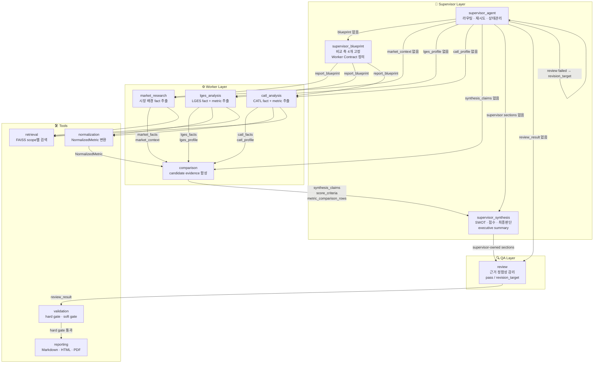
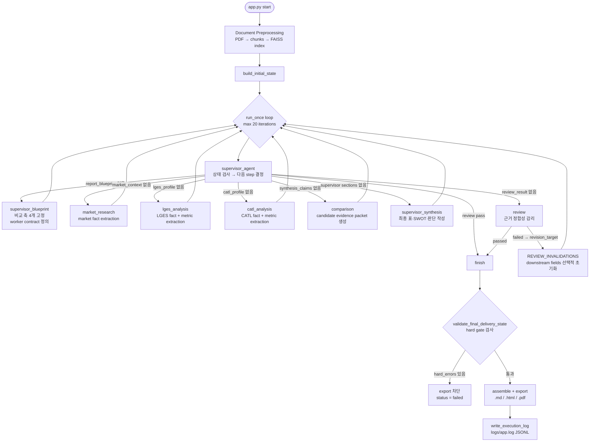

# Agentic RAG Battery Strategy Evaluator

LG에너지솔루션(LGES)과 CATL의 포트폴리오 다각화 전략을 근거 기반으로 비교 분석하기 위한 Agentic RAG 프로젝트입니다. 공식 PDF 문서를 FAISS로 인덱싱해 retrieval evidence를 확보하고, Supervisor 패턴 Multi-Agent 워크플로우로 시장 배경 · 기업별 전략 · 정량 비교 · SWOT · 점수화 · 최종 판단까지 자동으로 조립해 Markdown / HTML / PDF 보고서를 생성합니다.

> 단순 기업 소개가 아니라, 비교 축을 먼저 고정하고 근거를 단계별로 축적한 뒤 최종 판단까지 도출하는 파이프라인입니다.

---

## Overview

배터리 산업 비교 분석은 기업마다 지역 전략 · 제품 포트폴리오 · ESS 확장 방향 · 비용 구조 · 리스크 노출도 · 기술 로드맵이 달라, 동일 기준을 먼저 고정하지 않으면 결론이 왜곡되기 쉽습니다.

이 프로젝트는 `Supervisor Blueprint → Worker Evidence → Supervisor Synthesis → Review → Report Assembly` 순서로 책임을 분리해 이 문제를 해결합니다.

| 항목 | 내용 |
|-----|-----|
| 목표 | LGES와 CATL의 다각화 전략을 동일 기준으로 비교 분석 |
| 방식 | Supervisor 패턴 Multi-Agent + Agentic RAG |
| 입력 | PDF 문서셋, `document_manifest.json`, `.env` |
| 출력 | 전략 비교 보고서 (`.md` / `.html` / `.pdf`) 및 실행 로그 (`.log`) |
| 핵심 판단 요소 | 시장 배경, 전략 차이, 정량 비교, SWOT, 점수 근거, 최종 판단 |

---

## Architecture

### Design Intent

이 시스템의 아키텍처 목표는 두 가지입니다.

첫째, `비교 축 통제`. agent마다 자유롭게 비교 기준을 잡으면 결론이 흔들리므로, Supervisor Blueprint 단계에서 비교 축 4개를 먼저 고정하고 이후 모든 단계가 그 계약을 따릅니다.

둘째, `output ownership 명시`. worker는 근거(evidence)를 생산하는 역할로 제한하고, 최종 보고서 문장 · 점수 해석 · SWOT 종합 · 최종 판단은 Supervisor Synthesis만 작성합니다. 이 분리를 두지 않으면 누가 어떤 판단을 했는지가 흐려져 review와 retry가 어려워집니다.

즉 이 시스템은 "LLM이 멋진 문장을 쓰게 하는 것"이 목적이 아니라, **근거를 잃지 않은 채 비교 판단까지 가는 파이프라인**을 만드는 것이 목적입니다.

---

### Agent Topology



---

### Why Supervisor Pattern

이 과제는 단순 검색 결과 병합보다 `비교 축 통제` · `근거 기반 판단` · `재시도 및 수정 루프`가 더 중요합니다.

| 패턴 | 이 과제와의 적합성 | 선택 여부 |
|-----|-----------------|---------|
| Router | 단계 선택은 단순하지만 최종 판단 책임이 흐려질 수 있음 | 미채택 |
| Distributor | 병렬 작업 분배에는 유리하지만 최종 보고서 ownership이 분산됨 | 미채택 |
| Supervisor | 상태 기반 제어, revision loop, 최종 아웃풋 ownership 명시 용이 | **채택** |

이 저장소에서 Supervisor는 단순 라우터가 아닙니다. `report_blueprint`를 먼저 만들고, review 결과에 따라 특정 단계만 재실행하며, 최종 보고서 섹션의 owner를 고정합니다.

---

### Execution Model: Manual Supervisor Loop

이 프로젝트는 LangGraph의 `StateGraph.compile()` 방식을 사용하지 않습니다. `graph.py`의 `run_once()` 함수가 매 iteration마다 `supervisor_agent(state)` → `AGENT_REGISTRY[step](state)` 순서로 직접 실행하는 **수동 루프 구조**입니다.

```text
app.py  main()
  └─ for _ in range(MAX_WORKFLOW_ITERATIONS):   # 최대 20회
        state = run_once(state)                 # graph.py
          ├─ supervisor_agent(state)            # 다음 step 결정
          └─ AGENT_REGISTRY[step](state)        # worker 또는 synthesis 실행
```

이 선택의 이유는 `REVIEW_INVALIDATIONS` 기반의 downstream field 선택적 초기화, schema retry와 review retry의 독립적 예산 관리, 그리고 revision target에 따른 정밀한 상태 복구를 직접 제어하기 위해서입니다. LangGraph의 선언형 그래프로는 이 수준의 세밀한 상태 조작이 어렵습니다.

---

### End-to-End Workflow



---

## Agent Pipeline

### Detailed Agent Pipeline

| Step | 입력 | 주요 동작 | 출력 | 이 단계가 필요한 이유 |
|------|------|----------|------|----------------------|
| `supervisor_blueprint` | goal, target_companies, source_documents | 비교 축 4개 고정, worker 질문 세트 정의, comparability precheck 수행 | `report_blueprint` | agent마다 제멋대로 비교 기준을 잡지 않게 막기 위해 |
| `market_research` | blueprint, market retrieval hits | 시장 배경 fact 단위 추출, 두 기업에 공통 적용할 비교 축 힌트 정리 | `market_facts`, `market_context`, `market_context_summary` | 공통 외생 변수와 시장 문맥을 먼저 정리해 기업 분석에 컨텍스트 제공 |
| `lges_analysis` | blueprint, market summary, LGES retrieval hits | LGES 전략 · 리스크 · 정량 근거를 구조화 claim으로 추출, normalization 실행 | `lges_facts`, `lges_profile`, `lges_normalized_metrics`, `profitability_reported_rows` | LGES를 독립된 evidence packet으로 보존해 CATL과 섞이지 않게 하기 위해 |
| `catl_analysis` | blueprint, market summary, CATL retrieval hits | CATL 전략 · 리스크 · 정량 근거를 구조화 claim으로 추출, normalization 실행 | `catl_facts`, `catl_profile`, `catl_normalized_metrics`, `profitability_reported_rows` | LGES와 동일한 이유로 CATL evidence를 독립 보존 |
| `comparison` | market/company fact packet, normalized metrics | 검증된 claim catalog(최대 각 12개)만 사용해 candidate synthesis claims, score criteria, metric comparison rows 생성 | `comparison_input_spec`, `synthesis_claims`, `score_criteria`, `metric_comparison_rows`, `low_confidence_claims` | 비교 재료를 만들되 최종 판단 ownership은 supervisor에 유보 |
| `supervisor_synthesis` | blueprint + fact layer + comparison layer | 최종 보고서 섹션 직접 작성 — 비교표 선별, SWOT, score rationale, executive summary, final judgment | `selected_comparison_rows`, `reference_only_rows`, `chart_selection`, `executive_summary`, `supervisor_swot`, `supervisor_score_rationales`, `final_judgment`, `implications`, `limitations` | Supervisor가 최종 아웃풋 책임을 직접 소유해야 한다는 설계 원칙 구현 |
| `review` | report_spec, validation_warnings, low_confidence_claims | 근거-결론 연결 · 비교 축 일관성 · 필수 섹션 누락 감리 | `review_result`, `review_issues` | LLM이 생성한 최종 판단을 제출 계약 관점에서 한 번 더 검증 |
| `reporting / export` | 최종 state | Markdown / HTML / PDF 조립, hard gate 통과 후 export | `.md`, `.html`, `.pdf`, `.log` | 출력 포맷 분리, 미완성 결과가 export되지 않도록 차단 |

---

### Agent Responsibility Matrix

| Stage | Reads | Writes | Forbidden Outputs |
|------|-------|--------|-------------------|
| `supervisor_blueprint` | `goal`, `target_companies`, `source_documents` | `report_blueprint` | 최종 보고서 문장, `final_judgment` |
| `market_research` | `report_blueprint`, retrieval hits | `market_facts`, `market_context`, `market_context_summary` | `executive_summary`, `final_judgment`, `final_swot`, `final_score_rationale` |
| `lges_analysis` | `report_blueprint`, `market_context_summary`, retrieval hits | `lges_facts`, `lges_profile`, `lges_normalized_metrics`, `profitability_reported_rows` | 최종 보고서 문장, `final_judgment` |
| `catl_analysis` | `report_blueprint`, `market_context_summary`, retrieval hits | `catl_facts`, `catl_profile`, `catl_normalized_metrics`, `profitability_reported_rows` | 최종 보고서 문장, `final_judgment` |
| `comparison` | `market_facts`, `lges_facts`, `catl_facts`, normalized metrics | `comparison_input_spec`, `synthesis_claims`, `score_criteria`, `metric_comparison_rows`, `low_confidence_claims` | `executive_summary`, `final_judgment`, final SWOT prose |
| `supervisor_synthesis` | blueprint + fact layer + comparison layer | supervisor-owned report fields 전체 | worker evidence 재생성, 원문 재검색 |
| `review` | `report_spec`, `validation_warnings`, `low_confidence_claims` | `review_result`, `review_issues` | 새로운 사업 판단, 임의 수치 생성 |

`forbidden_outputs`는 컨벤션이 아닙니다. `ReportBlueprint` Pydantic `model_validator`가 인스턴스 생성 시점에 각 `WorkerTaskSpec.forbidden_outputs`에 `final_judgment`, `executive_summary`, `final_swot`, `final_score_rationale` 4개가 반드시 포함되는지 검증하며, 누락 시 `ValueError`를 발생시킵니다.

---

### Supervisor Routing and Governance

`agents/supervisor.py`의 `supervisor_agent()`는 `AgentState` 전체를 읽고 아래 우선순위로 다음 step을 결정합니다.

| 우선순위 | 조건 | 결정 | 의미 |
|--------|------|------|------|
| 1 | `status == "failed"` + schema retry 예산 남음 | 현재 step 재시도 | worker schema 검증 실패 복구 |
| 2 | `status == "failed"` + 예산 소진 | `finish` (failed) | 더 이상 복구 불가 |
| 3 | `review_result` 존재 + `passed == False` + review retry 예산 남음 | `review_result.revision_target` | revision target 단계로 롤백 |
| 4 | `review_result` 존재 + `passed == False` + 예산 소진 | `finish` (completed with issues) | advisory 상태로 종료 |
| 5 | `report_blueprint` 없음 | `supervisor_blueprint` | 비교 축 먼저 고정 |
| 6 | `market_context` 없음 | `market_research` | 시장 기준점 확보 |
| 7 | `lges_profile` 없음 | `lges_analysis` | LGES fact packet 생성 |
| 8 | `catl_profile` 없음 | `catl_analysis` | CATL fact packet 생성 |
| 9 | `synthesis_claims` 또는 `metric_comparison_rows` 없음 | `comparison` | supervisor용 candidate evidence 생성 |
| 10 | supervisor-owned sections 일부 없음 | `supervisor_synthesis` | 최종 판단과 보고서 핵심 문장 생성 |
| 11 | `review_result` 없음 | `review` | 제출 계약 감리 |
| 12 | 전부 충족 | `finish` | export 단계 진입 |

---

### REVIEW_INVALIDATIONS: Downstream Field Reset

review가 실패하거나 schema retry가 발생할 때, Supervisor는 revision target의 **downstream fields만 선택적으로 초기화**합니다. 이 매핑이 `agents/supervisor.py`의 `REVIEW_INVALIDATIONS` 딕셔너리에 step별로 명시돼 있습니다.

```text
# 예: review가 "comparison" 단계로 revision을 요청한 경우
REVIEW_INVALIDATIONS["comparison"] = (
    "comparison_input_spec", "synthesis_claims", "score_criteria",
    "metric_comparison_rows", "comparability_decisions",
    "selected_comparison_rows", "reference_only_rows",
    "chart_selection", "executive_summary", "company_strategy_summaries",
    "quick_comparison_panel", "supervisor_swot", "supervisor_score_rationales",
    "final_judgment", "implications", "limitations",
    "review_result", "review_issues",
)
# → comparison 이전의 market_facts, lges_facts, catl_facts는 그대로 보존
```

이 구조 덕분에 "어느 단계의 계약이 깨졌는지 식별하고 그 지점부터만 복구"할 수 있으며, 이전 단계의 비용이 드는 retrieval과 extraction을 반복하지 않습니다.

retry budget은 `RetryBudget` 모델로 독립 관리됩니다.

```python
class RetryBudget(BaseModel):
    schema_validation_max: int  # worker schema 실패 재시도 한도 (기본 2)
    review_max: int             # review 실패 revision 한도 (기본 2)
```

`schema_retry_count`와 `review_retry_count`는 서로 독립적으로 카운트되며, revision이 발생하면 `schema_retry_count`는 0으로 리셋됩니다.

---

### SWOT Design Decision

이 보고서의 목표는 두 기업을 개별 소개하는 것이 아니라 `LGES vs CATL 비교 판단`입니다.

SWOT는 회사별 진단으로 생성하되, 시사점과 종합 판단은 비교 결과를 합성한 `supervisor_synthesis`에서만 도출합니다. 개별 SWOT을 길게 풀어버리면 최종 비교 논리가 흐려지기 때문입니다.

soft gate의 `_add_raw_metric_swot_warning`은 SWOT 항목이 "revenue", "margin", "roe" 같은 raw metric 키워드만 포함하고 전략적 해석 키워드가 없으면 경고를 발생시킵니다.

---

## Data & State

### State Contract

`AgentState`는 에이전트 간 공용 인터페이스이며, 필드는 단계별 레이어로 나뉩니다.

#### Layer 1 — Blueprint

| 필드 | 타입 | 역할 |
|-----|------|------|
| `report_blueprint` | `ReportBlueprint` | 비교 축 4개 + comparability precheck + worker task specs |

`ReportBlueprint`의 `model_validator`는 (1) `comparison_axes`가 정해진 4개 축을 정확한 순서로 포함하는지, (2) `worker_task_specs`에 3개 worker가 모두 정의됐는지, (3) 각 worker의 `forbidden_outputs`에 필수 4개 필드가 포함됐는지를 인스턴스 생성 시점에 강제 검증합니다.

#### Layer 2 — Fact

| 필드 | 타입 | 생성 주체 |
|-----|------|---------|
| `market_facts` | `MarketFactExtractionOutput` | `market_research` |
| `market_context`, `market_context_summary` | `MarketContext`, `str` | `market_research` |
| `lges_facts` | `LGESFactExtractionOutput` | `lges_analysis` |
| `lges_profile`, `lges_normalized_metrics` | `CompanyProfile`, `list[NormalizedMetric]` | `lges_analysis` |
| `catl_facts` | `CATLFactExtractionOutput` | `catl_analysis` |
| `catl_profile`, `catl_normalized_metrics` | `CompanyProfile`, `list[NormalizedMetric]` | `catl_analysis` |
| `profitability_reported_rows` | `list[MetricComparisonRow]` | `lges_analysis` / `catl_analysis` |
| `citation_refs` | `list[EvidenceRef]` | 누적 |

`LGESFactExtractionOutput`과 `CATLFactExtractionOutput`은 각각 `model_validator`로 **required metric families**를 강제합니다.

```python
LGES_REQUIRED_METRIC_FAMILIES = (
    "revenue_growth_guidance", "operating_margin_guidance_or_actual",
    "capex", "ess_capacity", "secured_order_volume",
)

CATL_REQUIRED_METRIC_FAMILIES = (
    "revenue", "gross_profit_margin", "net_profit_margin", "roe", "operating_cash_flow",
)
```

이 중 하나라도 `metric_claims`에 없으면 `model_validate()` 시점에 `ValueError`가 발생하고, supervisor는 schema retry를 실행합니다.

`FactExtractionOutput`의 `_validate_claim_scope_alignment` validator는 모든 claim의 `scope`가 extraction scope와 일치하는지도 강제합니다. 이로써 LGES claim이 CATL 컨텍스트에 섞여 들어가는 오염을 방지합니다.

#### Layer 3 — Comparison (Candidate)

| 필드 | 타입 | 역할 |
|-----|------|------|
| `comparison_input_spec` | `ComparisonInputSpec` | LGES/CATL 각 최대 12개 claim catalog |
| `synthesis_claims` | `list[SynthesisClaim]` | cross-company 합성 claims |
| `score_criteria` | `list[ScoreCriterion]` | 점수 기준별 근거 (evidence_refs 포함) |
| `metric_comparison_rows` | `list[MetricComparisonRow]` | 정량 비교 행 전체 |
| `comparability_decisions` | `list[MetricComparisonRow]` | direct / reference_only / reject 분류 결과 |
| `low_confidence_claims` | `list[ClaimTrace]` | 신뢰도가 낮은 claim 목록 |

이 레이어는 supervisor synthesis의 **input 재료**입니다. 최종 보고서가 아닙니다.

`comparison`이 생성하는 `SynthesisClaim`은 `supporting_claim_ids`가 반드시 2개 이상이어야 하며, 그 ID가 `ComparisonInputSpec.allowed_claim_ids()` 집합에 속하지 않으면 hard gate 오류가 됩니다. 새로운 외부 근거를 발명하는 것을 구조적으로 차단합니다.

#### Layer 4 — Supervisor-Owned Report

| 필드 | 타입 | 역할 |
|-----|------|------|
| `selected_comparison_rows` | `list[MetricComparisonRow]` | direct comparability 행만 선별 |
| `reference_only_rows` | `list[MetricComparisonRow]` | 직접 비교 불가 — reference용 별도 표 |
| `chart_selection` | `list[ChartSpec]` | 보고서에 포함할 차트 spec |
| `executive_summary` | `list[str]` | 서두 요약 bullet |
| `company_strategy_summaries` | `dict[str, list[str]]` | 기업별 전략 요약 |
| `quick_comparison_panel` | `list[ComparisonRow]` | 전략 축별 one-line 비교 패널 |
| `supervisor_swot` | `list[SwotEntry]` | 기업별 SWOT |
| `supervisor_score_rationales` | `list[ScoreCriterion]` | 점수와 근거 (materialized evidence_refs) |
| `final_judgment` | `FinalJudgment` | 최종 종합 판단 |
| `implications` | `list[str]` | 시사점 |
| `limitations` | `list[str]` | 분석 한계 |
| `report_spec` | `ReportSpec` | 제출 계약 객체 전체 |

이 레이어는 worker가 절대 쓰지 않습니다. `supervisor_synthesis`와 `report assembly`만 소유합니다.

`ScoreCriterion.evidence_refs`는 `supporting_claim_ids`에서 상속하지 않고 **materialized field**로 유지합니다. 이를 통해 score 근거가 claim chain이 아닌 실제 문서 위치로 역추적됩니다.

#### Layer 5 — Review / Validation

| 필드 | 타입 | 역할 |
|-----|------|------|
| `review_result` | `ReviewResult` | `passed`, `revision_target`, `review_issues` |
| `review_issues` | `list[str]` | 구체적 감리 지적 사항 |
| `validation_warnings` | `list[str]` | soft gate 경고 목록 |
| `schema_retry_count` | `int` | worker schema 실패 누적 횟수 |
| `review_retry_count` | `int` | review revision 누적 횟수 |
| `routing_reason` | `str \| None` | supervisor 라우팅 결정 근거 로그 |
| `status` | `WorkflowStatus` | initialized → routing → running → completed / failed |
| `last_error` | `str \| None` | 마지막 실패 메시지 |

#### Layer 6 — Artifact

| 필드 | 타입 | 역할 |
|-----|------|------|
| `report_artifacts` | `list[ReportArtifact]` | `.md` / `.html` / `.pdf` / `.log` 생성 상태 추적 |
| `execution_log` | `list[ExecutionLogEntry]` | 단계별 실행 이력 (JSONL로 저장) |

---

### RAG and Evidence Flow

이 프로젝트의 RAG는 웹 검색 대체물이 아니라 **공식 문서 기반 evidence layer**입니다.

```text
data/raw/*.pdf
  └─ tools.preprocessing
        PDF 읽기 → 청킹 (1200자, overlap 200)
        → data/processed/corpus.jsonl
        → data/processed/document_manifest.processed.json

data/processed/corpus.jsonl
  └─ tools.retrieval
        intfloat/multilingual-e5-large embedding
        → FAISS 인덱스 (data/index/faiss.index)
        → 메타데이터 (data/index/faiss_metadata.jsonl)

각 worker agent
  └─ scope별 retrieval query (top-k=6)
        → EvidenceRef 수집
        → FactExtractionOutput (구조화 claim + evidence_refs)

tools.normalization
  └─ MetricFactClaim → NormalizedMetric
        (basis / period / unit 보존, guidance vs actual 구분)
        → profitability_reported_rows (direct vs reference_only 분리)

tools.comparison_contract
  └─ fact layer → ComparisonInputSpec (회사별 최대 12 claim)

comparison agent
  └─ ComparisonInputSpec만 사용 (새 retrieval 없음)
        → ComparisonEvidenceOutput (synthesis claims, score criteria, rows)

tools.reporting.build_report_spec
  └─ supervisor-owned state → ReportSpec (제출 계약 객체)

tools.reporting
  └─ ReportSpec → Markdown → HTML → Playwright PDF
```

`comparison` agent는 claim catalog(`ComparisonInputSpec`)만 사용하고 새 검색을 수행하지 않습니다. 이로써 비교 단계에서 새로운 외부 근거가 유입되는 것을 막습니다.

---

### Normalization Layer

배터리 기업 비교에서 가장 흔한 오류는 성격이 다른 숫자를 같은 표에 넣는 것입니다. 이 저장소는 이를 세 단계로 방지합니다.

**1단계 — Metric Family 강제 추출**: `LGESFactExtractionOutput` · `CATLFactExtractionOutput`의 `model_validator`가 required metric families를 검증합니다. 이 검증이 실패하면 worker schema 실패로 처리되고 supervisor가 재시도합니다.

**2단계 — NormalizedMetric 생성**: `tools/normalization.py`가 raw `MetricFactClaim`을 받아 `basis` (`guidance` vs `reported`) · `period` · `unit`을 보존한 채 `NormalizedMetric`으로 변환합니다. CATL의 `net_profit_margin`이 원문에서 직접 추출 불가한 경우 `revenue`와 `profit_for_the_year`에서 파생하며 `is_derived=True`로 마킹합니다.

**3단계 — Comparability 분류**: `MetricComparisonRow.comparability_status`를 `direct` / `reference_only` / `reject`로 분류합니다. `direct`만 비교표에 들어가고, `reference_only`는 별도 표로 분리됩니다. 서로 다른 회계 기준이나 공개 범위 차이로 직접 비교가 어려운 수치를 같은 표에 섞지 않기 위해서입니다.

---

## Quality Control

### Validation: Hard Gate and Soft Gate

`tools/validation.py`는 두 종류의 검증을 실행합니다.

**Hard Gate** — export를 차단하는 규칙입니다. `validate_final_delivery_state()`가 아래를 검사합니다.

| Rule Key | 검사 내용 |
|---------|---------|
| `required-section-missing` | `market_context`, `lges_profile`, `catl_profile`, `synthesis_claims`, `supervisor_score_rationales`, `supervisor_swot`, `executive_summary`, `final_judgment`, `citation_refs` 등 필수 섹션 누락 여부 |
| `required-chart-missing` | 최소 1개 interpretable chart 존재 여부 |
| `synthesis-support-count` | `SynthesisClaim`의 `supporting_claim_ids`가 2개 이상인지 |
| `score-criterion-evidence` | `ScoreCriterion`의 `evidence_refs` 존재 여부 |
| `metric-comparison-rows-missing` | `metric_comparison_rows` 존재 여부 |
| `supporting-claim-origin` | `supporting_claim_ids`가 `ComparisonInputSpec.allowed_claim_ids()` 범위 내인지 |
| `no-fallback-ref-backfill` | evidence를 `citation_refs`에서 역채움하지 않는지 |
| `blueprint-comparison-axes` | blueprint 비교 축 4개 정확성 |
| `fact-claim-evidence` | 모든 fact claim에 `evidence_refs` 존재 여부 |

**Soft Gate** — 경고로만 기록되며 export를 차단하지 않습니다.

| 경고 내용 | 검출 로직 |
|---------|---------|
| summary와 final_judgment 텍스트가 완전히 동일 | 정규화 후 문자열 비교 |
| 요약/판단에 수치 없이 범용 키워드만 사용 ("경쟁력", "전략" 등) | 숫자 문자 부재 + 범용 마커 탐지 |
| 한쪽 값만 있는 metric row에 basis 설명 누락 | `lges_value XOR catl_value` + `basis_note` 키워드 확인 |
| score rationale 반복 사용 | 정규화된 텍스트 중복 탐지 |
| SWOT 항목이 전략 해석 없이 raw metric만 나열 | metric 키워드 + 전략 해석 키워드 부재 탐지 |
| 단일 기간 차트에 "Trend" 제목 사용 | `x_axis_periods` 길이 확인 |

---

### Claim Provenance and Traceability

모든 claim은 `{scope}-{category}-{ordinal}` 형식의 결정론적 ID를 가집니다. 이 ID는 `ClaimBase.model_validator`가 scope / category / ordinal에서 자동 생성하며, 수동 입력 시 포맷 불일치를 `ValueError`로 차단합니다.

```text
"lges-capex-1"          # LGES capex 관련 첫 번째 claim
"catl-gross_profit_margin-2"  # CATL gross profit margin 두 번째 claim
```

이 ID 체계 덕분에 `SynthesisClaim.supporting_claim_ids` → `AtomicFactClaim` / `MetricFactClaim` → `EvidenceRef` → `DocumentRef` (source_path, page)까지 역추적이 가능합니다.

`ReportSpec.model_validator`는 전체 claim_id 집합에서 중복을 검출해 ValueError를 발생시킵니다.

---

### Report Assembly Pipeline

```text
supervisor_synthesis
  └─ supervisor-owned state fields 생성

tools.reporting.build_report_spec
  └─ state → ReportSpec (제출 계약 객체 조립)

review agent
  └─ ReportSpec 전체 감리 → ReviewResult

validate_final_delivery_state     ← hard gate
  └─ hard_errors → export 차단
  └─ soft_warnings → validation_warnings에 기록

assemble_markdown_report
assemble_html_report               ← Playwright PDF

write_execution_log
  └─ JSONL → logs/app.log
```

보고서 생성은 단순 텍스트 출력이 아니라 `state → ReportSpec → rendered artifacts`라는 별도 조립 경로를 거칩니다. `tools.reporting`은 renderer이고, 내용 책임은 `supervisor_synthesis + review + final validation`에 있습니다.

---

### Output Ownership Summary

| 산출물 | Owner |
|-------|-------|
| Fact extraction (claims, evidence_refs, normalized metrics) | worker agents |
| Candidate comparison evidence (synthesis_claims, score_criteria, rows) | `comparison` |
| Executive summary, final judgment, selected tables, supervisor SWOT, score rationale | `supervisor_synthesis` |
| Submission contract audit | `review` |
| Markdown / HTML / PDF assembly | `tools.reporting` |
| Export gate | `tools.validation.validate_final_delivery_state` |

---

## Decision Framework

최종 보고서의 점수와 판단은 아래 4개 기준으로 정리됩니다. 근거가 부족하면 추정하지 않고 `score: null`로 표기합니다.

| Criterion | 설명 |
|-----------|------|
| `portfolio_diversification` | EV 외 확장, 포트폴리오 폭, 전략 선택지 |
| `technology_product_strategy` | 기술 방향, 제품 다양성, R&D 투자 |
| `regional_supply_chain` | 지역 전략, 공급망 구성, 수요 대응력 |
| `financial_resilience` | 비용 구조, 수익성, 리스크 대응 여력 |

---

## Scoring Principles

- 각 기준은 `1~5점` 또는 `null` (정보 부족)로 표현합니다.
- 점수는 `ScoreCriterion.rationale` + `ScoreCriterion.evidence_refs`가 함께 존재해야 합니다.
- `evidence_refs`는 `supporting_claim_ids`에서 상속하지 않고 materialized field로 유지합니다.
- hard gate를 통과하지 못한 결과는 export되지 않습니다.

---

## Tech Stack

| Category | Details |
|----------|---------|
| Language | Python 3.11+ |
| LLM | OpenAI GPT-4.1-mini |
| Embedding | `intfloat/multilingual-e5-large` |
| Vector Search | FAISS |
| Schema / Validation | Pydantic v2 |
| PDF Processing | pypdf |
| Report Export | HTML + Playwright (Chromium) PDF |
| Test | pytest |
| Orchestration | 수동 supervisor loop (`graph.py`) |

---

## Project Structure

```text
.
├── app.py                          # 진입점: 전처리 → 워크플로우 루프 → export
├── graph.py                        # run_once(): supervisor → AGENT_REGISTRY[step] 수동 루프
├── state.py                        # AgentState TypedDict + 모든 Pydantic 모델
├── config.py                       # 환경변수 로드 및 경로 설정
├── requirements.txt
├── .env.example
├── agents/
│   ├── supervisor.py               # 라우팅 결정 + REVIEW_INVALIDATIONS
│   ├── supervisor_blueprint.py     # 비교 축 고정 + worker contract 정의
│   ├── market_research.py          # 시장 fact extraction
│   ├── lges_analysis.py            # LGES fact + normalization
│   ├── catl_analysis.py            # CATL fact + normalization
│   ├── comparison.py               # candidate evidence packet 생성
│   ├── supervisor_synthesis.py     # 최종 보고서 섹션 작성
│   ├── review.py                   # 제출 계약 감리
│   └── company_analysis.py         # 공통 분석 헬퍼
├── prompts/
│   ├── __init__.py
│   └── structured.py               # 구조화 출력 프롬프트 + guardrail
├── tools/
│   ├── preprocessing.py            # PDF 청킹 → corpus.jsonl
│   ├── retrieval.py                # embedding → FAISS 인덱스 준비
│   ├── normalization.py            # MetricFactClaim → NormalizedMetric
│   ├── comparison_contract.py      # fact layer → ComparisonInputSpec
│   ├── comparison_fallback.py      # comparison 실패 fallback 처리
│   ├── fact_conversion.py          # fact 변환 헬퍼
│   ├── fact_fallbacks.py           # fact extraction 실패 fallback
│   ├── charting.py                 # ChartSpec 생성 및 검증
│   ├── validation.py               # hard gate + soft gate
│   ├── reporting.py                # ReportSpec → Markdown / HTML / PDF
│   └── openai_client.py            # OpenAI 클라이언트 래퍼
├── data/
│   ├── document_manifest.json      # 문서 메타데이터 및 scope 정의
│   ├── document_manifest.example.json
│   ├── raw/                        # 원본 PDF
│   ├── processed/                  # chunked corpus + processed manifest
│   └── index/                      # FAISS 인덱스 + retrieval metadata
├── docs/
│   ├── design.md                   # 설계 근거 보조 문서
│   └── runbook.md                  # 실행 및 제출 운영 가이드
├── tests/
│   ├── fixtures/
│   ├── conftest.py
│   ├── test_schema_contracts.py    # ReportBlueprint validator + claim scope alignment
│   ├── test_comparison_contract.py # ComparisonInputSpec allowed_claim_ids 경계 검증
│   ├── test_fact_extraction_agents.py  # required metric families 충족 여부
│   ├── test_normalization.py       # NormalizedMetric 변환 정확성 + derived metric 마킹
│   ├── test_validation.py          # hard gate / soft gate 규칙 전체
│   ├── test_review_prompt.py       # review agent 판단 로직
│   ├── test_supervisor.py          # REVIEW_INVALIDATIONS + retry budget 소진 시나리오
│   ├── test_charting.py            # ChartSpec 생성 및 trend title 경고
│   ├── test_reporting.py           # ReportSpec → Markdown / HTML 렌더링
│   ├── test_app_e2e.py             # 전체 워크플로우 smoke test
│   └── test_acceptance_suite.py    # 제출 기준 acceptance 검증
├── outputs/                        # 최종 보고서 출력
└── logs/                           # JSONL 실행 로그
```

---

## Setup

### Requirements

- Python 3.11+
- OpenAI API key
- Playwright Chromium (PDF export용)

### 1. Install Dependencies

```bash
python3 -m venv .venv
.venv/bin/pip install -r requirements.txt
.venv/bin/python -m playwright install chromium
cp .env.example .env
```

### 2. Configure Environment Variables

`.env`에 아래 항목을 채웁니다.

```env
OPENAI_API_KEY=
OPENAI_MODEL=gpt-4.1-mini
OPENAI_TIMEOUT_SECONDS=60
OPENAI_MAX_OUTPUT_TOKENS=2000
EMBEDDING_MODEL=intfloat/multilingual-e5-large

DOCUMENT_MANIFEST_PATH=data/document_manifest.json
PROCESSED_MANIFEST_PATH=data/processed/document_manifest.processed.json
PROCESSED_CORPUS_PATH=data/processed/corpus.jsonl
FAISS_INDEX_PATH=data/index/faiss.index
RETRIEVAL_METADATA_PATH=data/index/faiss_metadata.jsonl
RETRIEVAL_MANIFEST_PATH=data/index/retrieval_manifest.json
OUTPUT_MARKDOWN_PATH=outputs/report.md
OUTPUT_HTML_PATH=outputs/report.html
OUTPUT_PDF_PATH=outputs/report.pdf
LOG_PATH=logs/app.log

PREPROCESS_CHUNK_SIZE=1200
PREPROCESS_CHUNK_OVERLAP=200
RETRIEVAL_TOP_K=6

MAX_SCHEMA_RETRIES=2
MAX_REVIEW_RETRIES=2
```

### 3. Prepare Documents

PDF 파일을 `data/raw/` 아래에 두고 `data/document_manifest.json`에 메타데이터를 작성합니다. 예시는 `data/document_manifest.example.json`을 참고하세요.

```json
{
  "document_id": "lges-ir-2024",
  "title": "LG Energy Solution IR Presentation 2024",
  "source_path": "data/raw/lges_ir_2024.pdf",
  "source_type": "presentation",
  "company_scope": "lges",
  "published_at": "2024-03",
  "page_range": "1-40"
}
```

`company_scope`는 `market` / `lges` / `catl` / `shared` 중 하나입니다. retrieval 단계에서 scope별 필터링에 사용됩니다.

### 4. Run

```bash
TOKENIZERS_PARALLELISM=false OMP_NUM_THREADS=1 .venv/bin/python app.py
```

### 5. Useful Commands

```bash
# 전처리만 실행
.venv/bin/python -m tools.preprocessing

# FAISS 인덱스만 재빌드
.venv/bin/python -m tools.retrieval

# 테스트
.venv/bin/pytest -q
```

---

## Outputs

| 파일 | 설명 |
|-----|-----|
| `outputs/report.md` | 제출용 Markdown 보고서 |
| `outputs/report.html` | 브라우저 검토용 HTML 보고서 |
| `outputs/report.pdf` | 공유/제출용 PDF (Playwright 렌더링) |
| `logs/app.log` | JSONL 실행 로그 — 단계별 step, status, routing_reason, attempt 기록 |

---

## Acceptance Coverage

| 범주 | 테스트 | 검증 내용 |
|-----|--------|---------|
| Schema / Contract | `test_schema_contracts.py`, `test_comparison_contract.py` | `ReportBlueprint` model_validator, claim scope alignment, `allowed_claim_ids` 경계 |
| Fact Extraction / Normalization | `test_fact_extraction_agents.py`, `test_normalization.py` | required metric families 충족, NormalizedMetric 변환, derived metric 마킹 |
| Validator / Review | `test_validation.py`, `test_review_prompt.py`, `test_supervisor.py` | hard gate 규칙 전체, soft gate 탐지 로직, REVIEW_INVALIDATIONS 동작, retry budget 소진 |
| Reporting / Charting | `test_reporting.py`, `test_charting.py` | ReportSpec → Markdown/HTML 렌더링, trend title 경고 |
| Workflow / Export E2E | `test_app_e2e.py`, `test_acceptance_suite.py` | 전체 워크플로우 smoke, 제출 기준 acceptance |

---

## Limitations

- 최신 정보 수집보다 공식 문서 기반 근거 일관성에 최적화돼 있습니다. 문서셋 품질이 결과 품질에 직접 영향을 줍니다.
- 기업별 공개 문서 분량과 범위가 다르면 비교 밀도가 달라질 수 있습니다.
- 정량 비교는 disclosed basis를 유지하므로, 서로 다른 회계 기준이나 기간은 완전 통합하지 않습니다.
- 이 시스템은 전략 검토 보조 도구이며 실제 투자나 사업 의사결정을 대체하지 않습니다.

---
