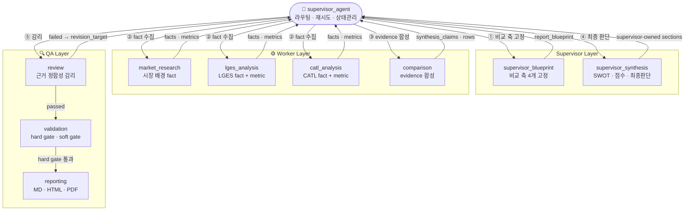
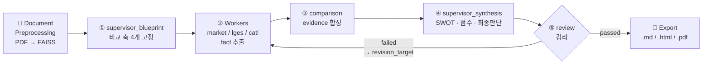
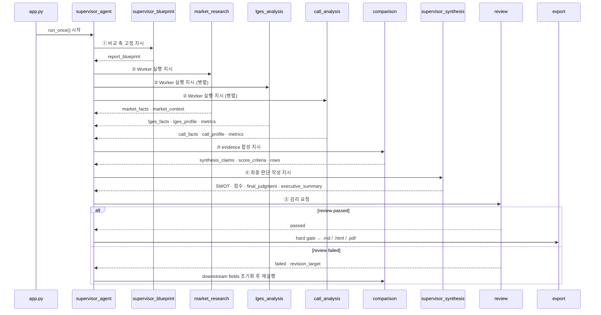
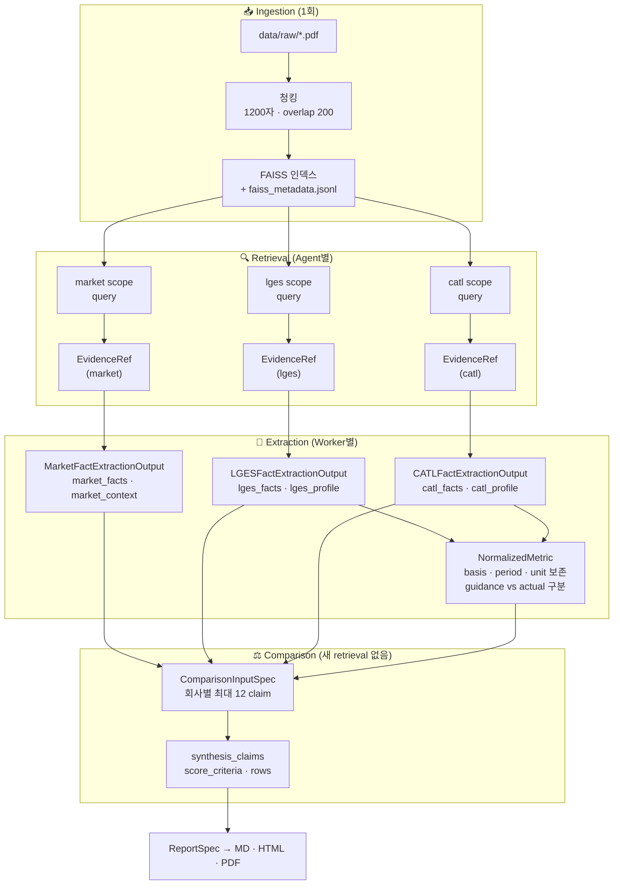

# Agentic RAG Battery Strategy Evaluator

LG에너지솔루션(LGES)과 CATL의 포트폴리오 다각화 전략을 근거 기반으로 비교 분석하기 위한 Agentic RAG 프로젝트입니다. 공식 PDF 문서를 FAISS로 인덱싱해 retrieval evidence를 확보하고, Supervisor 패턴 Multi-Agent 워크플로우로 시장 배경 · 기업별 전략 · 정량 비교 · SWOT · 점수화 · 최종 판단까지 자동으로 조립해 Markdown / HTML / PDF 보고서를 생성합니다.

> 비교 축을 먼저 정하고, 근거를 단계별로 축적한 뒤 최종 판단까지 이어지도록 구성한 파이프라인입니다.

---

## Overview

배터리 산업 비교 분석은 기업마다 지역 전략 · 제품 포트폴리오 · ESS 확장 방향 · 비용 구조 · 리스크 노출도 · 기술 로드맵이 달라, 동일 기준을 먼저 고정하지 않으면 결론이 왜곡되기 쉽습니다.

이 프로젝트는 `Supervisor Blueprint → Worker Evidence → Supervisor Synthesis → Review → Report Assembly` 순서로 책임을 분리해 이 문제를 해결합니다.

| 항목 | 내용 |
|-----|-----|
| 목표 | LGES와 CATL의 다각화 전략을 동일 기준으로 비교 분석 |
| 방식 | Supervisor 패턴 Multi-Agent + Agentic RAG |
| 입력 | PDF 문서셋, `document_manifest.json`, `.env` |
| 출력 | 전략 비교 보고서 (`.md` / `.html` / `.pdf`) 및 실행 로그 (`.log`) |
| 핵심 판단 요소 | 시장 배경, 전략 차이, 정량 비교, SWOT, 점수 근거, 최종 판단 |

---

## Architecture

### Design Intent

이 시스템은 두 가지 설계 의도를 기준으로 구성했습니다.

첫째, `비교 축 통제`입니다. agent마다 비교 기준을 다르게 잡으면 결론이 흔들릴 수 있어, Supervisor Blueprint 단계에서 비교 축 4개를 먼저 정하고 이후 단계가 같은 기준을 사용하도록 만들었습니다.

둘째, `output ownership 분리`입니다. worker는 근거(evidence)를 수집하고 정리하는 역할을 맡고, 최종 보고서 문장 · 점수 해석 · SWOT 종합 · 최종 판단은 Supervisor Synthesis에서 작성하도록 역할을 나눴습니다. 이렇게 구분해 두면 어떤 단계에서 어떤 판단이 나왔는지 추적하기 쉬워지고, review나 retry를 걸 때도 기준이 명확해집니다.

전체적으로는 문장 생성 자체보다, **근거를 유지한 상태에서 비교 판단까지 이어지는 흐름**을 만드는 쪽에 초점을 두었습니다.

---

### Agent Topology



---

### Execution Model: Manual Supervisor Loop

이 프로젝트에서는 LangGraph의 `StateGraph.compile()` 대신 `graph.py`의 `run_once()` 함수를 중심으로 한 수동 루프 구조를 사용했습니다. 각 iteration마다 `supervisor_agent(state)` → `AGENT_REGISTRY[step](state)` 순서로 실행됩니다.

```text
app.py  main()
  └─ for _ in range(MAX_WORKFLOW_ITERATIONS):   # 최대 20회
        state = run_once(state)                 # graph.py
          ├─ supervisor_agent(state)            # 다음 step 결정
          └─ AGENT_REGISTRY[step](state)        # worker 또는 synthesis 실행
```

이 방식을 사용한 이유는 `REVIEW_INVALIDATIONS` 기반의 downstream field 선택적 초기화, schema retry와 review retry의 독립적 예산 관리, revision target별 상태 복구를 코드에서 직접 다루기 쉬웠기 때문입니다. 현재 구현에서는 선언형 그래프보다 수동 루프가 상태 전이를 더 세밀하게 표현하는 데 맞았습니다.

---

### End-to-End Workflow



---

## Agent Pipeline

### Execution Sequence



---

## Data & State

### State Contract

`AgentState`는 에이전트 간 공용 인터페이스로 사용했고, 필드는 크게 여섯 레이어로 나눴습니다.

| Layer | 역할 |
|-----|------|
| Blueprint | 비교 축, worker contract, comparability precheck를 담는 설계 레이어 |
| Fact | market / LGES / CATL 근거와 정량 추출값을 담는 evidence 레이어 |
| Comparison | synthesis claims, score criteria, metric rows처럼 supervisor synthesis 전에 쓰는 비교 재료 |
| Supervisor-Owned Report | executive summary, SWOT, score rationale, final judgment 등 최종 보고서 레이어 |
| Review / Validation | review 결과, 경고, retry count, status처럼 제어와 감리를 위한 레이어 |
| Artifact | `.md` / `.html` / `.pdf` / `.log` 산출물과 실행 이력 레이어 |

이렇게 나눠 둔 이유는 worker가 만드는 evidence와 supervisor가 작성하는 최종 보고서 필드를 분리하고, review나 retry 시 어느 구간을 다시 실행해야 하는지 상태 기준으로 다루기 쉽게 하기 위해서였습니다.

---

### RAG and Evidence Flow

이 프로젝트의 RAG는 웹 검색을 대체하는 용도보다는 **공식 문서 기반 evidence layer**로 사용하는 쪽에 맞춰 두었습니다.



`comparison` agent는 `ComparisonInputSpec`만 사용하고 새 검색은 수행하지 않도록 했습니다. 비교 단계에서 근거 집합이 흔들리지 않게 하려는 이유였습니다.

---

### Normalization Layer

회계 기준이나 공개 범위가 다른 수치를 직접 비교하지 않도록, 정량 지표는 `basis` · `period` · `unit`을 보존한 채 정규화하고 `direct` / `reference_only` / `reject`로 비교 가능성을 분류합니다. `direct`만 비교표에 포함됩니다. 상세 처리 로직은 [design.md](./docs/design.md)를 참고하세요.

---

## Quality Control

### Validation: Hard Gate and Soft Gate

`tools/validation.py`는 두 종류의 검증을 실행합니다.

**Hard Gate** — export 여부에 직접 영향을 주는 규칙입니다. `validate_final_delivery_state()`가 아래 항목을 검사합니다.

| Rule Key | 검사 내용 |
|---------|---------|
| `required-section-missing` | `market_context`, `lges_profile`, `catl_profile`, `synthesis_claims`, `supervisor_score_rationales`, `supervisor_swot`, `executive_summary`, `final_judgment`, `citation_refs` 등 필수 섹션 누락 여부 |
| `required-chart-missing` | 최소 1개 interpretable chart 존재 여부 |
| `synthesis-support-count` | `SynthesisClaim`의 `supporting_claim_ids`가 2개 이상인지 |
| `score-criterion-evidence` | `ScoreCriterion`의 `evidence_refs` 존재 여부 |
| `metric-comparison-rows-missing` | `metric_comparison_rows` 존재 여부 |
| `supporting-claim-origin` | `supporting_claim_ids`가 `ComparisonInputSpec.allowed_claim_ids()` 범위 내인지 |
| `no-fallback-ref-backfill` | evidence를 `citation_refs`에서 역채움하지 않는지 |
| `blueprint-comparison-axes` | blueprint 비교 축 4개 정확성 |
| `fact-claim-evidence` | 모든 fact claim에 `evidence_refs` 존재 여부 |

**Soft Gate** — 경고로 기록하는 규칙입니다. export는 막지 않고, 결과 해석 시 참고할 수 있게 남깁니다.

| 경고 내용 | 검출 로직 |
|---------|---------|
| summary와 final_judgment 텍스트가 완전히 동일 | 정규화 후 문자열 비교 |
| 요약/판단에 수치 없이 범용 키워드만 사용 ("경쟁력", "전략" 등) | 숫자 문자 부재 + 범용 마커 탐지 |
| 한쪽 값만 있는 metric row에 basis 설명 누락 | `lges_value XOR catl_value` + `basis_note` 키워드 확인 |
| score rationale 반복 사용 | 정규화된 텍스트 중복 탐지 |
| SWOT 항목이 전략 해석 없이 raw metric만 나열 | metric 키워드 + 전략 해석 키워드 부재 탐지 |
| 단일 기간 차트에 "Trend" 제목 사용 | `x_axis_periods` 길이 확인 |

---

### Claim Provenance and Traceability

모든 claim은 `{scope}-{category}-{ordinal}` 형식의 ID를 사용합니다. 이 ID를 기준으로 synthesis claim에서 fact claim, evidence, 원문 문서 위치까지 다시 따라갈 수 있게 구성했습니다. 최종 판단을 문서 근거와 연결해 설명하려는 목적에 맞춘 설계였습니다.

---

---

## Decision Framework

최종 보고서의 점수와 판단은 아래 4개 기준으로 정리됩니다. 근거가 부족하면 추정하지 않고 `score: null`로 표기합니다.

| Criterion | 설명 |
|-----------|------|
| `portfolio_diversification` | EV 외 확장, 포트폴리오 폭, 전략 선택지 |
| `technology_product_strategy` | 기술 방향, 제품 다양성, R&D 투자 |
| `regional_supply_chain` | 지역 전략, 공급망 구성, 수요 대응력 |
| `financial_resilience` | 비용 구조, 수익성, 리스크 대응 여력 |

---

## Scoring Principles

- 각 기준은 `1~5점` 또는 `null` (정보 부족)로 표현합니다.
- 점수는 `ScoreCriterion.rationale` + `ScoreCriterion.evidence_refs`가 함께 존재해야 합니다.
- `evidence_refs`는 `supporting_claim_ids`에서 상속하지 않고 materialized field로 유지합니다.
- hard gate를 통과하지 못한 결과는 export되지 않습니다.

---

## Tech Stack

| Category | Details |
|----------|---------|
| Language | Python 3.11+ |
| LLM | OpenAI GPT-4.1-mini |
| Embedding | `intfloat/multilingual-e5-large` |
| Vector Search | FAISS |
| Schema / Validation | Pydantic v2 |
| PDF Processing | pypdf |
| Report Export | HTML + Playwright (Chromium) PDF |
| Test | pytest |
| Orchestration | 수동 supervisor loop (`graph.py`) |

---

## Project Structure

```text
.
├── app.py                          # 진입점: 전처리 → 워크플로우 루프 → export
├── graph.py                        # run_once(): supervisor → AGENT_REGISTRY[step] 수동 루프
├── state.py                        # AgentState TypedDict + 모든 Pydantic 모델
├── config.py                       # 환경변수 로드 및 경로 설정
├── requirements.txt
├── .env.example
├── agents/
│   ├── supervisor.py               # 라우팅 결정 + REVIEW_INVALIDATIONS
│   ├── supervisor_blueprint.py     # 비교 축 고정 + worker contract 정의
│   ├── market_research.py          # 시장 fact extraction
│   ├── lges_analysis.py            # LGES fact + normalization
│   ├── catl_analysis.py            # CATL fact + normalization
│   ├── comparison.py               # candidate evidence packet 생성
│   ├── supervisor_synthesis.py     # 최종 보고서 섹션 작성
│   ├── review.py                   # 제출 계약 감리
│   └── company_analysis.py         # 공통 분석 헬퍼
├── prompts/
│   ├── __init__.py
│   └── structured.py               # 구조화 출력 프롬프트 + guardrail
├── tools/
│   ├── preprocessing.py            # PDF 청킹 → corpus.jsonl
│   ├── retrieval.py                # embedding → FAISS 인덱스 준비
│   ├── normalization.py            # MetricFactClaim → NormalizedMetric
│   ├── comparison_contract.py      # fact layer → ComparisonInputSpec
│   ├── comparison_fallback.py      # comparison 실패 fallback 처리
│   ├── fact_conversion.py          # fact 변환 헬퍼
│   ├── fact_fallbacks.py           # fact extraction 실패 fallback
│   ├── charting.py                 # ChartSpec 생성 및 검증
│   ├── validation.py               # hard gate + soft gate
│   ├── reporting.py                # ReportSpec → Markdown / HTML / PDF
│   └── openai_client.py            # OpenAI 클라이언트 래퍼
├── data/
│   ├── document_manifest.json      # 문서 메타데이터 및 scope 정의
│   ├── document_manifest.example.json
│   ├── raw/                        # 원본 PDF
│   ├── processed/                  # chunked corpus + processed manifest
│   └── index/                      # FAISS 인덱스 + retrieval metadata
├── docs/
│   ├── design.md                   # 설계 근거 보조 문서
│   └── runbook.md                  # 실행 및 제출 운영 가이드
├── tests/                          # schema, agent, validation, reporting, e2e 테스트
├── outputs/                        # 최종 보고서 출력
└── logs/                           # JSONL 실행 로그
```

---

## Setup

<details>
<summary>설치 및 실행 가이드 펼치기</summary>

### Requirements

- Python 3.11+
- OpenAI API key
- Playwright Chromium (PDF export용)

### 1. Install Dependencies

```bash
python3 -m venv .venv
.venv/bin/pip install -r requirements.txt
.venv/bin/python -m playwright install chromium
cp .env.example .env
```

### 2. Configure Environment Variables

`.env`에 아래 항목을 채웁니다.

```env
OPENAI_API_KEY=
OPENAI_MODEL=gpt-4.1-mini
OPENAI_TIMEOUT_SECONDS=60
OPENAI_MAX_OUTPUT_TOKENS=2000
EMBEDDING_MODEL=intfloat/multilingual-e5-large

DOCUMENT_MANIFEST_PATH=data/document_manifest.json
PROCESSED_MANIFEST_PATH=data/processed/document_manifest.processed.json
PROCESSED_CORPUS_PATH=data/processed/corpus.jsonl
FAISS_INDEX_PATH=data/index/faiss.index
RETRIEVAL_METADATA_PATH=data/index/faiss_metadata.jsonl
RETRIEVAL_MANIFEST_PATH=data/index/retrieval_manifest.json
OUTPUT_MARKDOWN_PATH=outputs/report.md
OUTPUT_HTML_PATH=outputs/report.html
OUTPUT_PDF_PATH=outputs/report.pdf
LOG_PATH=logs/app.log

PREPROCESS_CHUNK_SIZE=1200
PREPROCESS_CHUNK_OVERLAP=200
RETRIEVAL_TOP_K=6

MAX_SCHEMA_RETRIES=2
MAX_REVIEW_RETRIES=2
```

### 3. Prepare Documents

PDF 파일을 `data/raw/` 아래에 두고 `data/document_manifest.json`에 메타데이터를 작성합니다. 예시는 `data/document_manifest.example.json`을 참고하세요.

```json
{
  "document_id": "lges-ir-2024",
  "title": "LG Energy Solution IR Presentation 2024",
  "source_path": "data/raw/lges_ir_2024.pdf",
  "source_type": "presentation",
  "company_scope": "lges",
  "published_at": "2024-03",
  "page_range": "1-40"
}
```

`company_scope`는 `market` / `lges` / `catl` / `shared` 중 하나입니다. retrieval 단계에서 scope별 필터링에 사용됩니다.

### 4. Run

```bash
TOKENIZERS_PARALLELISM=false OMP_NUM_THREADS=1 .venv/bin/python app.py
```

### 5. Useful Commands

```bash
# 전처리만 실행
.venv/bin/python -m tools.preprocessing

# FAISS 인덱스만 재빌드
.venv/bin/python -m tools.retrieval

# 테스트
.venv/bin/pytest -q
```

</details>

---

## Outputs

| 파일 | 설명 |
|-----|-----|
| `outputs/report.md` | 제출용 Markdown 보고서 |
| `outputs/report.html` | 브라우저 검토용 HTML 보고서 |
| `outputs/report.pdf` | 공유/제출용 PDF (Playwright 렌더링) |
| `logs/app.log` | JSONL 실행 로그 — 단계별 step, status, routing_reason, attempt 기록 |

---

## Limitations

- 최신 정보 수집보다 공식 문서 기반 근거 일관성에 최적화돼 있습니다. 문서셋 품질이 결과 품질에 직접 영향을 줍니다.
- 기업별 공개 문서 분량과 범위가 다르면 비교 밀도가 달라질 수 있습니다.
- 정량 비교는 disclosed basis를 유지하므로, 서로 다른 회계 기준이나 기간은 완전 통합하지 않습니다.
- 이 시스템은 전략 검토 보조 도구이며 실제 투자나 사업 의사결정을 대체하지 않습니다.

---

최신 PDF 보고서: [outputs/report.pdf](./outputs/report.pdf)
