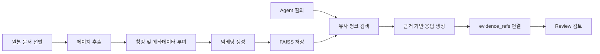
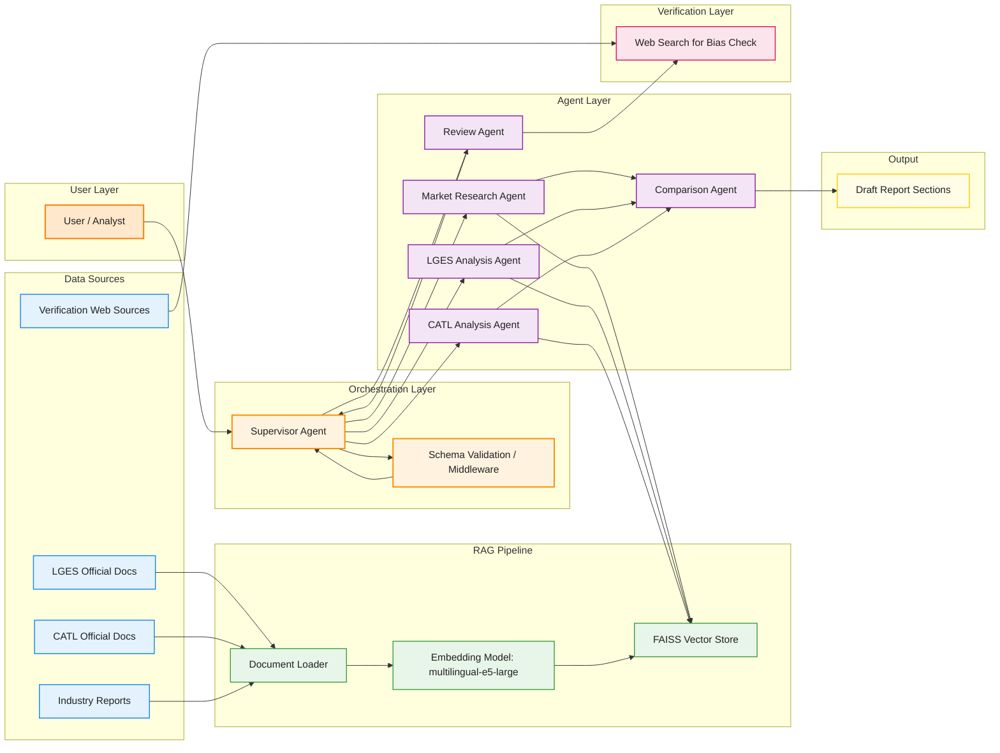

# 배터리 시장 전략 분석 Multi-Agent 설계 산출물

## 1. Summary
본 프로젝트는 EV 캐즘 환경에서 `LG에너지솔루션`과 `CATL`의 포트폴리오 다각화 전략을 비교 분석하고, 의사결정자가 활용 가능한 수준의 근거 기반 인사이트를 도출하는 Multi-Agent 시스템을 설계하는 것을 목표로 한다. 본 설계는 `Supervisor 패턴`을 중심으로 구성되며, 시장 조사, 기업별 전략 분석, 비교 분석, 검토 단계를 분리해 수행한다. 근거 확보는 `Agentic RAG`를 중심으로 하고, 웹 검색은 최신 정보 수집용이 아니라 `편향 방지`와 `교차 검증` 용도로만 제한적으로 사용한다. 또한 LGES와 CATL 분석 경로를 분리하여 문맥 오염을 방지하고, 동일 출력 스키마를 강제해 비교 일관성을 확보한다.

## 2. Goal
EV 캐즘 환경에서 LG에너지솔루션과 CATL의 포트폴리오 전략 차이를 분석하고, 의사결정자가 활용 가능한 수준의 근거 기반 인사이트를 도출한다.

## 3. Success Criteria
- 모든 핵심 주장과 수치에는 출처가 연결되어 있어야 한다.
- 시장 배경, 기업별 전략, 비교 분석, SWOT, 시사점, Summary, Reference가 모두 포함되어야 한다.
- 두 기업은 동일 비교 축과 동일 기준으로 분석되어야 한다.
- 긍정적 서술에 치우치지 않고 약점, 리스크, 위협이 함께 반영되어야 한다.
- 1인 기준으로 구현과 디버깅이 가능한 수준의 구조여야 한다.
- 재시도 제한 안에서 결과를 종료할 수 있어야 한다.

### 측정 기준
- 각 핵심 장에 정량 근거를 최소 1개 이상 포함
- 중요 결론은 가능하면 2개 이상 출처로 교차 검증
- SWOT은 내부(S/W), 외부(O/T) 구분
- `SUMMARY`는 반 페이지 이내
- `REFERENCE`는 지정 양식 준수
- 기업 분석 결과는 동일 스키마 검증 통과
- 점수화 결과는 모두 `evidence_refs`와 연결

## 4. 구조 선택
본 시스템은 `Supervisor 패턴`을 사용한다. Supervisor가 전체 상태를 읽고 다음 Agent를 호출하며, 재탐색, 재작성, 검증 실패, 종료 조건을 일관되게 통제한다. `Dispatcher`는 사용하지 않는다. 이유는 본 과제가 설명 가능한 설계와 흐름 제어를 강조하고 있으며, 1인 구현 기준에서 중앙 제어 구조가 가장 안정적이기 때문이다.

## 5. 핵심 설계 원칙
- LGES와 CATL은 하나의 범용 Agent에 파라미터만 바꿔 넣지 않고 분리된 분석 Agent로 설계한다.
- 두 기업 데이터는 비교 전까지 섞지 않고 `Comparison Agent`에서만 통합한다.
- 웹 검색은 최신 정보 확보용이 아니라 `편향 방지`, `교차 검증`, `반대 관점 보완` 용도로만 사용한다.
- Bias Check와 Reflection은 별도 Agent로 늘리지 않고 `Review Agent`에 통합한다.
- 제출 형식 검수는 LLM Agent가 아니라 체크리스트 또는 간단한 코드 검증으로 처리한다.
- State에는 원문 전체가 아니라 요약 결과와 참조 키만 유지한다.
- 기업 분석 결과는 동일 `CompanyProfile` 스키마를 강제하고, 검증 통과 후에만 Comparison 단계로 전달한다.
- LGES/CATL 분석은 상호 독립 작업이므로 Fan-out/Fan-in 병렬 확장이 가능하나, 1인 구현 안정성을 위해 기본 실행은 순차로 둔다.
- 근거가 부족한 경우 추정하지 않고 `정보 부족` 상태로 명시한다.

## 6. Task Decomposition

| Task | 설명 | 담당 Agent | 선행 Task |
|---|---|---|---|
| T1 | 시장 환경 조사 | Market Research Agent | - |
| T2 | LG에너지솔루션 전략 분석 | LGES Analysis Agent | T1 |
| T3 | CATL 전략 분석 | CATL Analysis Agent | T1 |
| T4 | 정량 데이터 정리 | LGES / CATL Analysis Agent | T2, T3 |
| T5 | 스키마 검증 | Schema Validation (Middleware) | T2, T3, T4 |
| T6 | 비교 분석, SWOT 생성, 근거 기반 점수화 | Comparison Agent | T5 |
| T7 | Review 수행 | Review Agent | T6 |
| T8 | 보고서 조립 | Report Assembly (코드) | T7 |
| T9 | Summary 작성 | LLM (Report Assembly 내) | T8 |
| T10 | Reference 정리 | LLM (Report Assembly 내) | T8 |
| T11 | 제출 체크리스트 검수 | 코드 검증 | T9, T10 |

> **의존 관계 요약**: T2와 T3는 T1 완료 후 순차 실행(기본), 병렬 확장 가능. T5는 T2/T3/T4 모두 완료 후 진행. T9와 T10은 T8 완료 후 병렬 처리 가능.

## 7. RAG 문서 채택표
기준: `PDF 실제 페이지 기준`  
원칙: 총 `100페이지 이내`, 공식 자료 우선, 웹 검색은 편향 보정 및 교차 검증용 보조 수단으로만 사용  
주의: 실제 구현 시 페이지 추출은 `PDF 실제 페이지 기준`으로 수행하며, 문서 내 인쇄 페이지 번호와 혼동하지 않는다.

### 기본 패키지

| 구분 | 문서명 | 페이지 | 목적 | 주요 추출 항목 | 사용 Agent |
|---|---|---:|---|---|---|
| 시장 배경 | IEA `Global EV Outlook 2025` | 10~18 | EV 시장 구조 | 글로벌 EV 성장, 지역별 격차, 중국 우위, 가격 경쟁력, 생산/수출 구조 | Market Research Agent |
| 시장/기술 | IEA `Global EV Outlook 2025` | 134~146 | 배터리 산업 구조 | 배터리 경쟁 구도, sodium-ion, CATL 기술 흐름 | Market Research Agent, CATL Analysis Agent |
| LGES 전략 | `25_4Q_LGES_business_performance_F_EN.pdf` | 5~12 | 전략 + 실적 | EV 둔화, ESS 확대, LFP/HV Mid-Ni, 46 Series, Capex 축소, 2026 가이던스 | LGES Analysis Agent |
| LGES 방향성 | `LGES CEO Keynote` | 4~10 | 환경 변화 + 포트폴리오 방향 | 정책 변화, EV/ESS 구조 변화, 포트폴리오 리밸런싱, 투자 우선순위 | LGES Analysis Agent |
| CATL 전략 | `CATL Prospectus` | 11~25 | 회사 개요 + 전략 | 글로벌 생산, 고객 기반, 경쟁력, 성장 전략, Naxtra 언급 | CATL Analysis Agent |
| CATL 리스크 | `CATL Prospectus` | 53~60 | 리스크 분석 | 수요 변화, 정책 리스크, 가격 경쟁, 기술 경쟁, 공급망 리스크 | CATL Analysis Agent, Review Agent |
| CATL 산업 위치 | `CATL Prospectus` | 125~143 | 산업 구조 + 점유율 | EV/ESS 시장 구조, CATL/LGES 상대 위치, sodium-ion 및 차세대 배터리 | CATL Analysis Agent, Comparison Agent |

### 선택 패키지

| 구분 | 문서명 | 페이지 | 목적 | 주요 추출 항목 | 사용 Agent |
|---|---|---:|---|---|---|
| CATL 다각화 | `CATL Prospectus` | 171~179 | 비EV 확장 전략 | emerging applications, ecosystem, non-EV diversification | CATL Analysis Agent, Comparison Agent |

선택 규칙: `CATL 171~179`는 총 페이지 수 또는 구현 시간 제약이 있을 경우 우선 제외한다.

## 8. Agent Definition
### Supervisor Agent
- 역할: 전체 흐름 제어, 상태 판단, 다음 단계 결정, 재실행 여부 결정
- Input: 전체 `AgentState`
- Output: `current_step`, `status`, 다음 실행 대상

### Market Research Agent
- 역할: EV/배터리 시장 배경 조사 및 요약
- Input: `research_questions`, `market_evidence_refs`
- Output: `market_context`, `market_context_summary`

### LGES Analysis Agent
- 역할: LG에너지솔루션 전략, 핵심 경쟁력, 리스크 분석
- Input: `lges_query`, `lges_evidence_refs`
- Output: `lges_profile`

### CATL Analysis Agent
- 역할: CATL 전략, 핵심 경쟁력, 리스크 분석
- Input: `catl_query`, `catl_evidence_refs`
- Output: `catl_profile`

### Comparison Agent
- 역할: 동일 스키마를 통과한 두 기업 프로필을 기준으로 비교표, SWOT, scorecard 생성
- Input: `market_context`, `lges_profile`, `catl_profile`
- Output: `comparison_matrix`, `swot_matrix`, `scorecard`

### Review Agent
- 역할: 편향, 근거성, 비교 일관성, 결론-근거 연결성을 검토하고 재탐색/재작성 필요 여부 판단
- Input: `comparison_matrix`, `swot_matrix`, `scorecard`, `citation_refs`, `market_context_summary`, `low_confidence_claims`
- Output: `review_result`, `revision_target`, `review_issues`, `status`

## 9. Agent 특징 요약

| Agent | 핵심 역할 | 주요 입력 | 주요 출력 | 특징 |
|---|---|---|---|---|
| Supervisor Agent | 전체 흐름 제어 | `AgentState` 전체 | `current_step`, `status` | 중앙 통제형 라우팅, 재시도와 종료 판단 담당 |
| Market Research Agent | 시장 배경 생성 | `research_questions`, `market_evidence_refs` | `market_context`, `market_context_summary` | 시장 변화와 외부 환경을 요약해 이후 비교의 기준점 제공 |
| LGES Analysis Agent | LGES 전략 분석 | `lges_query`, `lges_evidence_refs` | `lges_profile` | LGES 전용 분석 경로로 문맥 오염 방지 |
| CATL Analysis Agent | CATL 전략 분석 | `catl_query`, `catl_evidence_refs` | `catl_profile` | CATL 전용 분석 경로로 문맥 오염 방지 |
| Comparison Agent | 비교표, SWOT, scorecard 생성 | `market_context`, `lges_profile`, `catl_profile` | `comparison_matrix`, `swot_matrix`, `scorecard` | 동일 스키마 기반 비교와 점수화 수행 |
| Review Agent | 품질 및 편향 검토 | `comparison_matrix`, `swot_matrix`, `scorecard`, `citation_refs`, `low_confidence_claims` | `review_result`, `review_issues` | 저신뢰 주장 집중 검토, 재탐색/재작성 필요 여부 판단 |

## 10. RAG Pipeline
본 시스템의 RAG는 단순 검색이 아니라, `문서 선별 -> 페이지 추출 -> 임베딩 -> 검색 -> 근거 연결 -> 검토` 흐름으로 동작한다.

### 단계별 흐름
1. 공식 자료와 산업 보고서에서 필요한 페이지만 선별한다.
2. 선별한 페이지를 기준으로 PDF 실제 페이지 단위로 추출한다.
3. 추출 문서를 청킹하고 메타데이터(`문서명`, `섹션명`, `날짜`, `출처 유형`)를 부여한다.
4. `multilingual-e5-large`로 임베딩을 생성하고 `FAISS`에 저장한다.
5. 각 Agent는 자신의 질의에 맞는 관련 chunk를 검색한다.
6. 검색된 chunk를 바탕으로 구조화 출력과 `evidence_refs`를 포함한 결과를 생성한다.
7. Review Agent는 최종 원문 전체가 아니라 요약 결과, 참조 키, 저신뢰 주장 목록을 중심으로 검토한다.

### RAG 설계 원칙
- 최신성이 필요한 정보는 가능한 한 문서셋 구성 단계에서 반영한다.
- 웹 검색은 문서셋의 편향 보정과 교차 검증이 필요한 경우에만 제한적으로 사용한다.
- 검색 결과는 원문 전체를 State에 누적하지 않고, 필요한 요약 결과와 참조 키만 유지한다.
- 핵심 주장과 점수화 결과는 모두 `evidence_refs`로 역추적 가능해야 한다.

### RAG Pipeline Diagram


## 11. 기술 스택 요약

| 구분 | 사용 기술 | 역할 |
|---|---|---|
| Framework | LangGraph, LangChain, Python | Supervisor 기반 멀티에이전트 워크플로우 구현 |
| Retrieval | FAISS | 임베딩 기반 유사 청크 검색 |
| Embedding | `intfloat/multilingual-e5-large` | 한/영 혼합 문서 임베딩 |
| Validation | Pydantic Structured Output | CompanyProfile, Comparison, Scorecard 스키마 검증 |
| Governance | Runtime Governance / Middleware | 재시도, 타임아웃, 로깅, 검증 통제 |
| Output | Markdown, PDF | 최종 보고서 작성 및 제출 |

## 12. 공통 분석 지시 템플릿
LGES Analysis Agent와 CATL Analysis Agent는 동일한 질문 축으로 분석하도록 설계한다. 스키마 일치뿐 아니라 내용 깊이와 비교 축도 동일하게 맞추기 위한 장치다.

### 공통 분석 항목
- 사업 개요 및 최근 실적
- 포트폴리오 다각화 전략
- 지역 전략: 북미 / 유럽 / 아시아
- 제품 전략: EV / ESS / 기타 신사업
- 기술 전략: LFP, Mid-Ni, 46-series, sodium-ion 등
- 비용 경쟁력 및 투자 방향
- 고객사 또는 시장 의존 리스크
- 외부 환경 대응: 정책, 관세, 수요 둔화, 가격 경쟁
- 핵심 근거 및 수치
- 주요 리스크

## 13. 출력 스키마 설계
### CompanyProfile
- `company_name`
- `business_overview`
- `core_products`
- `diversification_strategy`
- `regional_strategy`
- `technology_strategy`
- `financial_indicators`
- `risk_factors`
- `evidence_refs`

### Comparison 출력 스키마
- `comparison_matrix`
  - `strategy_axis`
  - `lges_value`
  - `catl_value`
  - `difference`
  - `implication`
  - `evidence_refs`
- `swot_matrix`
  - `company_name`
  - `strengths`
  - `weaknesses`
  - `opportunities`
  - `threats`
  - `evidence_refs`

### Scorecard 스키마
- `company_name`
- `diversification_strength`
- `cost_competitiveness`
- `market_adaptability`
- `risk_exposure`
- `score_rationale`
- `evidence_refs`

### 스코어 표현 방식
- 점수는 `1~5 정수 스케일`로 통일한다.
- 근거 부족 시 억지 점수 부여 대신 `정보 부족` 또는 `null` 처리한다.

### 검증 원칙
- 두 기업 프로필은 동일한 `CompanyProfile` 스키마를 따른다.
- 구현 시 `Pydantic` 또는 이에 준하는 Structured Output 검증을 사용한다.
- `LGES_SCHEMA_OK`와 `CATL_SCHEMA_OK`가 모두 만족될 때만 `SCHEMA_VALIDATED` 이벤트가 발생한다.
- 스키마 검증 실패 시 Supervisor가 해당 분석 Agent에 재생성을 지시한다.
- 스키마 검증은 개념적으로 별도 단계로 두되, 실제 구현에서는 `after_model` 수준 검증 로직과 구조화 출력 검증으로 강제한다.

## 14. 근거 추적성과 점수화 설계
- 모든 핵심 주장과 비교 결과는 `evidence_refs`와 연결한다.
- Comparison Agent가 생성한 차이점, 시사점, 점수는 모두 역추적 가능해야 한다.
- 각 결론 단위는 `claim`, `evidence_refs`, `confidence_level` 구조를 유지한다.
- confidence는 `high / medium / low` 수준으로만 표현한다.
- Review Agent에는 `low_confidence_claims`를 별도 입력으로 제공해, 낮은 신뢰도의 주장만 집중 검토하도록 한다.
- 점수화는 판단 보조용이며, 점수만 단독 제시하지 않고 반드시 `score_rationale + evidence_refs`와 함께 제시한다.

## 15. Control Strategy
### 기본 원칙
- Supervisor가 전체 상태를 읽고 다음 Agent를 호출한다.
- 각 Agent는 자기 역할 범위의 결과만 생성한다.
- 근거 부족 시 다음 단계로 진행하지 않는다.
- 스키마 검증을 통과해야 비교 분석으로 진행한다.
- Review를 통과해야 보고서 조립 단계로 넘어간다.

### 진행 조건
- 시장 분석 완료 후 기업별 분석 진행
- LGES와 CATL 분석 경로는 논리적으로 분리
- 실제 구현은 순차 실행을 기본으로 하고 필요 시 병렬 확장 가능
- 두 기업 프로필이 모두 생성되고 스키마 검증을 통과해야 비교 분석 진행
- 비교표, SWOT, scorecard가 준비되어야 Review 진행
- Review 통과 후 보고서 조립 진행

### 재탐색 조건
- 공식 자료 또는 기관 자료가 부족함
- 정량 근거가 부족함
- 특정 기업 또는 특정 관점에 출처가 편중됨
- RAG 결과만으로 반대 관점 검증이 부족함

### 재작성 조건
- 출처 없는 핵심 문장이 존재함
- 두 기업 비교 항목이 다름
- SWOT, 시사점, 점수화 결과가 앞선 근거와 연결되지 않음
- 결론이 시장 배경 및 기업 데이터와 일관되지 않음
- CompanyProfile 스키마 검증에 실패함

### Review 기준
- 근거 충분성
- 기업 간 비교 일관성
- 결론-근거 연결성
- 편향 여부
- 점수화 결과의 근거 연결 여부

### 실패 대응
- 일부 분석 결과가 누락되더라도 즉시 전체 흐름을 중단하지 않는다.
- 핵심 비교 항목이 부족하면 해당 항목을 `정보 부족`으로 표시하고 종료할 수 있다.
- 병렬 확장 시 일부 분기 실패가 발생해도 전체 워크플로우는 fallback 상태를 허용한다.

### 재시도 정책
- `schema_retry_count <= 2`
- `review_retry_count <= 2`
- 스키마 검증 실패와 Review 실패는 별도 카운터로 관리한다.

## 16. Runtime Governance 원칙
- 재시도, 타임아웃, 로깅, 스키마 검증 등의 운영 정책은 에이전트 내부 판단 로직과 분리하여 `Runtime Governance` 계층에서 통제한다.
- 스키마 검증, 비용 추적, 실패 처리, 재시도 정책은 가능하면 미들웨어 또는 실행 경계 계층에서 관리한다.
- Human-in-the-Loop는 본 설계의 필수 요소는 아니며, 향후 확장 시 Review 이후 승인 단계로 추가 가능하다.

## 17. State 설계
### 핵심 상태 필드
- `goal`
- `target_companies`
- `research_questions`
- `source_documents`
- `market_context`
- `market_context_summary`
- `lges_profile`
- `catl_profile`
- `comparison_matrix`
- `swot_matrix`
- `scorecard`
- `citation_refs`
- `low_confidence_claims`
- `review_result`
- `revision_target`
- `review_issues`
- `schema_validation_status`
- `schema_retry_count`
- `review_retry_count`
- `current_step`
- `status`

### State 원칙
- 각 Agent는 필요한 필드만 읽고 자기 출력 필드만 쓴다.
- State는 에이전트 간 공용 인터페이스다.
- `lges_profile`과 `catl_profile`은 분리 유지하고 Comparison 단계에서만 통합한다.
- 재시도 카운터와 상태 필드는 Supervisor가 관리한다.

### State 경량화 원칙
- 원문 전체와 긴 초안 텍스트를 State에 누적하지 않는다.
- 상세 Evidence는 외부 문서 또는 벡터 저장소에서 관리하고 State에는 요약 결과와 참조 키만 둔다.
- Review Agent는 원문 전체가 아니라 `comparison_matrix`, `swot_matrix`, `scorecard`, `citation_refs`, `market_context_summary`, `low_confidence_claims` 중심으로 평가한다.
- 중간 결과는 Append보다 요약 후 Overwrite를 우선한다.

## 18. 이벤트 정의

| 이벤트 | 발생 조건 | 트리거 대상 |
|---|---|---|
| `START` | 시스템 초기화 완료 | Supervisor Agent |
| `RAG_READY` | 문서 로딩 및 FAISS 인덱스 생성 완료 | Market Research Agent |
| `MARKET_DONE` | 시장 배경 분석 완료 | LGES Analysis Agent |
| `LGES_DONE` | LGES 전략 분석 완료 | CATL Analysis Agent |
| `CATL_DONE` | CATL 전략 분석 완료 | Schema Validation |
| `LGES_SCHEMA_OK` | LGES 프로필 스키마 검증 통과 | Supervisor (부분 조건) |
| `CATL_SCHEMA_OK` | CATL 프로필 스키마 검증 통과 | Supervisor (부분 조건) |
| `SCHEMA_VALIDATED` | `LGES_SCHEMA_OK` + `CATL_SCHEMA_OK` 모두 만족 | Comparison Agent |
| `COMPARISON_DONE` | 비교표, SWOT, Scorecard 생성 완료 | Review Agent |
| `REVIEW_FAIL` | Review 기준 미충족 (재탐색 또는 재작성 필요) | Supervisor (재시도 판단) |
| `REPORT_READY` | Review 통과 후 보고서 조립 완료 | Summary + Reference |
| `FINISHED` | 제출 체크리스트 통과 | 종료 |

> **주석**: `SCHEMA_VALIDATED`는 LGES와 CATL이 모두 스키마 검증을 통과했을 때만 발생한다. 스키마 검증 실패 시 Supervisor가 해당 분석 Agent에 재생성을 지시하며, 재시도 횟수는 `schema_retry_count <= 2`로 제한한다.

## 19. Workflow Diagram
```mermaid
A([Start]) --> B[Supervisor Agent]

B --> C[Load Documents and Build FAISS Index]

C --> D[Market Research Agent]
D --> E[LGES Analysis Agent]
E --> F[CATL Analysis Agent]

F --> G{Schema Validation}
G -->|Valid| H[Comparison Agent]
G -->|Invalid| B

H --> I{Review Agent}
I -->|Pass| J[Report Assembly]
I -->|Fail| B

J --> K[Summary and References]
K --> L[Submission Checklist]
L --> M([Finished])

%% optional state labels
B -.->|RAG_READY| C
D -.->|MARKET_DONE| E
E -.->|LGES_DONE| F
F -.->|CATL_DONE| G
H -.->|COMPARISON_DONE| I
J -.->|REPORT_READY| K

%% styles
classDef startend fill:#FFE8CC,stroke:#FF7A00,stroke-width:2px,color:#222;
classDef core fill:#FFF3E0,stroke:#FB8C00,stroke-width:1.8px,color:#222;
classDef agent fill:#F3E5F5,stroke:#8E24AA,stroke-width:1.5px,color:#222;
classDef process fill:#E8F5E9,stroke:#43A047,stroke-width:1.5px,color:#222;
classDef decision fill:#FCE4EC,stroke:#D81B60,stroke-width:1.8px,color:#222;
classDef output fill:#FFFDE7,stroke:#FDD835,stroke-width:1.8px,color:#222;

class A,M startend
class B core
class C,J,K,L process
class D,E,F,H,I agent
class G decision
```

> **병렬 확장 고려**: 기본 실행은 위 다이어그램 기준 순차 흐름으로 운영한다. LGES Analysis(T2)와 CATL Analysis(T3)는 논리적으로 독립적이므로, 향후 Fan-out/Fan-in 방식으로 병렬 실행으로 전환할 수 있다. 단, 1인 구현 안정성을 위해 병렬 전환은 순차 실행 검증 이후 적용한다.

## 20. System Architecture Diagram


## 21. 보고서 목차

| 보고서 장 | Agent 출력 소스 | 주요 필드 |
|---|---|---|
| `SUMMARY` | Report Assembly (LLM 생성) | 전체 결론 요약 (반 페이지 이내) |
| `1. 시장 배경` | Market Research Agent | `market_context`, `market_context_summary` |
| `2. LG에너지솔루션 포트폴리오 전략과 핵심 경쟁력` | LGES Analysis Agent | `lges_profile` (CompanyProfile 스키마) |
| `3. CATL 포트폴리오 전략과 핵심 경쟁력` | CATL Analysis Agent | `catl_profile` (CompanyProfile 스키마) |
| `4. 핵심 전략 비교 분석` | Comparison Agent | `comparison_matrix` |
| `5. SWOT 분석` | Comparison Agent | `swot_matrix` |
| `6. 시사점` | Comparison Agent + Review Agent | `scorecard`, `review_result` |
| `REFERENCE` | Report Assembly (코드 생성) | `citation_refs` 기반 자동 정리 |

## 22. 제출 운영 규칙
### SUMMARY
- 보고서 맨 앞
- 반드시 `반 페이지 이내`
- 개요가 아니라 핵심 결론 요약

### REFERENCE
- 보고서 맨 마지막
- 실제 사용한 자료만 기재
- 양식 준수
  - 기관 보고서: `발행기관(YYYY). 보고서명. URL`
  - 학술 논문: `저자(YYYY). 논문제목. 학술지명, 권(호), 페이지`
  - 웹페이지: `기관명 또는 작성자(YYYY-MM-DD). 제목. 사이트명, URL`

### README
- Contributors에는 실제 역할만 기재
- `PM`, `PL` 제외

### 파일명
- 최종 PDF 파일명: `agent_{X반}_{이름1+이름2}.pdf`
