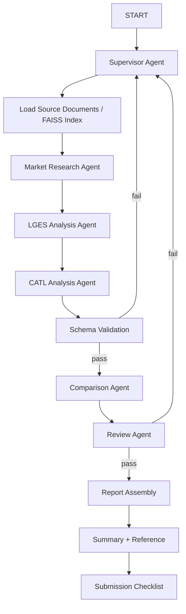

# 배터리 시장 전략 분석 Multi-Agent 설계 산출물

## Summary
본 프로젝트는 EV 캐즘 환경에서 LG에너지솔루션과 CATL의 포트폴리오 다각화 전략을 비교 분석하고, 의사결정자가 활용 가능한 수준의 근거 기반 인사이트를 도출하는 멀티에이전트 시스템을 설계하는 것을 목표로 한다. 시스템은 `Supervisor 패턴`을 기반으로 하며, 시장 조사, 기업별 분석, 비교 분석, 검토 단계를 분리해 수행한다. 근거 확보는 `Agentic RAG`를 중심으로 하고, 웹 검색은 최신 정보 확보가 아니라 `편향 보정`과 `교차 검증` 용도로만 제한적으로 사용한다.

## Goal
EV 캐즘 환경에서 LG에너지솔루션과 CATL의 포트폴리오 전략 차이를 분석하고, 의사결정자가 활용 가능한 수준의 근거 기반 인사이트를 도출한다.

## Success Criteria
- 모든 핵심 주장과 수치에는 출처가 연결되어 있어야 한다.
- 시장 배경, 기업별 전략, 비교 분석, SWOT, 시사점, Summary, Reference가 모두 포함되어야 한다.
- 두 기업은 동일 비교 축과 동일 기준으로 비교되어야 한다.
- 긍정적 서술에 치우치지 않고 약점, 리스크, 위협이 함께 반영되어야 한다.
- 1인 기준으로 구현과 디버깅이 가능한 수준의 구조여야 한다.

## RAG 문서 채택표
기준: `PDF 실제 페이지 기준`  
원칙: 총 `100페이지 이내`, 공식 자료 우선, 웹 검색은 편향 보정 및 교차 검증용 보조 수단으로만 사용

### 기본 패키지

| 구분 | 문서명 | 페이지 | 목적 | 주요 추출 항목 | 사용 Agent |
|---|---|---:|---|---|---|
| 시장 배경 | IEA `Global EV Outlook 2025` | 10~18 | EV 시장 구조 | 글로벌 EV 성장, 지역별 격차, 중국 우위, 가격 경쟁력, 생산/수출 구조 | Market Research Agent |
| 시장/기술 | IEA `Global EV Outlook 2025` | 134~146 | 배터리 산업 구조 | 배터리 경쟁 구도, sodium-ion, CATL 기술 흐름 | Market Research Agent, CATL Analysis Agent |
| LGES 전략 | `25_4Q_LGES_business_performance_F_EN.pdf` | 5~12 | 전략 + 실적 | EV 둔화, ESS 확대, LFP/HV Mid-Ni, 46 Series, Capex 축소, 2026 가이던스 | LGES Analysis Agent |
| LGES 방향성 | `LGES CEO Keynote` | 4~10 | 환경 변화 + 포트폴리오 방향 | 정책 변화, EV/ESS 구조 변화, 포트폴리오 리밸런싱, 투자 우선순위 | LGES Analysis Agent |
| CATL 전략 | `CATL Prospectus` | 11~25 | 회사 개요 + 전략 | 글로벌 생산, 고객 기반, 경쟁력, 성장 전략, Naxtra 언급 | CATL Analysis Agent |
| CATL 리스크 | `CATL Prospectus` | 53~60 | 리스크 분석 | 수요 변화, 정책 리스크, 가격 경쟁, 기술 경쟁, 공급망 리스크 | CATL Analysis Agent, Review Agent |
| CATL 산업 위치 | `CATL Prospectus` | 125~143 | 산업 구조 + 점유율 | EV/ESS 시장 구조, CATL/LGES 상대 위치, sodium-ion 및 차세대 배터리 | CATL Analysis Agent, Comparison Agent |

### 선택 패키지

| 구분 | 문서명 | 페이지 | 목적 | 주요 추출 항목 | 사용 Agent |
|---|---|---:|---|---|---|
| CATL 다각화 | `CATL Prospectus` | 171~179 | 비EV 확장 전략 | emerging applications, ecosystem, non-EV diversification | CATL Analysis Agent, Comparison Agent |

선택 규칙: `CATL 171~179`는 총 페이지 수 또는 구현 시간 제약이 있을 경우 우선 제외한다.

## Agent Definition
- Supervisor Agent: 흐름 제어, 재시도 판단, 다음 단계 라우팅
- Market Research Agent: 시장 배경 요약
- LGES Analysis Agent: `lges_profile` 생성
- CATL Analysis Agent: `catl_profile` 생성
- Comparison Agent: `comparison_matrix`, `swot_matrix`, `scorecard` 생성
- Review Agent: 근거성, 일관성, 편향 검토

## 공통 분석 지시 템플릿
LGES Analysis Agent와 CATL Analysis Agent는 동일한 질문 축으로 분석하도록 설계한다.

- 사업 개요 및 최근 실적
- 포트폴리오 다각화 전략
- 지역 전략: 북미 / 유럽 / 아시아
- 제품 전략: EV / ESS / 기타 신사업
- 기술 전략
- 비용 경쟁력 및 투자 방향
- 고객사 또는 시장 의존 리스크
- 정책, 관세, 수요 둔화 대응

## 구조화 출력
### CompanyProfile
- company_name
- business_overview
- core_products
- diversification_strategy
- regional_strategy
- technology_strategy
- financial_indicators
- risk_factors
- evidence_refs

### Comparison Output
- comparison_matrix: strategy_axis, lges_value, catl_value, difference, implication, evidence_refs
- swot_matrix: company_name, strengths, weaknesses, opportunities, threats, evidence_refs
- scorecard: company_name, diversification_strength, cost_competitiveness, market_adaptability, risk_exposure, score_rationale, evidence_refs

## Control Strategy
- Supervisor가 각 단계를 라우팅한다.
- LGES와 CATL 분석은 논리적으로 분리한다.
- 기본 실행은 순차이지만 Fan-out/Fan-in 확장이 가능하다.
- 스키마 검증 통과 후에만 Comparison으로 진행한다.
- Review 통과 후에만 보고서 조립 단계로 넘어간다.
- 근거 부족 시 추정하지 않고 `정보 부족`으로 처리한다.

## Runtime Governance
- 재시도, 타임아웃, 로깅, 스키마 검증은 에이전트 내부가 아니라 실행 경계 계층에서 통제한다.
- 구조화 출력 검증과 후처리 검증을 함께 사용한다.

## State Design
- goal
- target_companies
- market_context
- market_context_summary
- lges_profile
- catl_profile
- comparison_matrix
- swot_matrix
- scorecard
- citation_refs
- low_confidence_claims
- review_result
- review_issues
- schema_retry_count
- review_retry_count
- current_step
- status

## Workflow Diagram

## 보고서 목차
1. SUMMARY
2. 시장 배경
3. LG에너지솔루션 전략
4. CATL 전략
5. 핵심 전략 비교 분석
6. SWOT 분석
7. 시사점
8. REFERENCE
