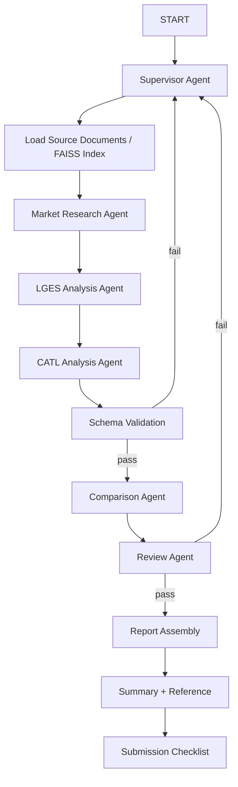

# Battery Market Strategy Analysis Multi-Agent Design

## Summary
This project designs a multi-agent system that compares the portfolio diversification strategies of LG Energy Solution and CATL under the EV downturn. The system uses a supervisor-based workflow, agentic RAG, structured outputs, and evidence-based comparison to generate a strategy analysis report.

## Goal
Analyze the strategic differences between LG Energy Solution and CATL and derive evidence-based insights that can support decision-making.

## Success Criteria
- All major claims and metrics are tied to sources.
- Market background, company strategies, comparison, SWOT, implications, summary, and references are all included.
- Both companies are compared using the same dimensions.
- Positive and negative evidence are both reflected.
- The workflow remains feasible for a one-person implementation.

## RAG Document Selection
- IEA Global EV Outlook 2025: 10-18, 134-146
- 25_4Q_LGES_business_performance_F_EN.pdf: 5-12
- LGES CEO Keynote: 4-10
- CATL Prospectus: 11-25, 53-60, 125-143
- Optional: CATL Prospectus 171-179

## Agent Definition
- Supervisor Agent: Controls flow, retries, and transitions
- Market Research Agent: Builds market context
- LGES Analysis Agent: Produces `lges_profile`
- CATL Analysis Agent: Produces `catl_profile`
- Comparison Agent: Produces `comparison_matrix`, `swot_matrix`, `scorecard`
- Review Agent: Reviews evidence quality, consistency, and bias

## Common Analysis Template
Both company analysis agents must evaluate:
- Business overview and recent performance
- Diversification strategy
- Regional strategy: North America, Europe, Asia
- Product strategy: EV, ESS, new applications
- Technology strategy
- Cost competitiveness and investment direction
- Customer or market dependency risks
- Policy, tariff, and demand slowdown exposure

## Structured Output
### CompanyProfile
- company_name
- business_overview
- core_products
- diversification_strategy
- regional_strategy
- technology_strategy
- financial_indicators
- risk_factors
- evidence_refs

### Comparison Output
- comparison_matrix: strategy_axis, lges_value, catl_value, difference, implication, evidence_refs
- swot_matrix: company_name, strengths, weaknesses, opportunities, threats, evidence_refs
- scorecard: company_name, diversification_strength, cost_competitiveness, market_adaptability, risk_exposure, score_rationale, evidence_refs

## Control Strategy
- The Supervisor routes each step.
- LGES and CATL analysis are logically separated.
- Default execution is sequential, but the design supports fan-out/fan-in expansion.
- Schema validation must pass before comparison.
- Review must pass before report assembly.
- Missing evidence is handled as `information unavailable` instead of hallucinated completion.

## Runtime Governance
- Retry, timeout, logging, and schema validation are controlled outside core agent reasoning where possible.
- Schema checks should be implemented with structured output validation and post-model verification.

## State Design
- goal
- target_companies
- market_context
- market_context_summary
- lges_profile
- catl_profile
- comparison_matrix
- swot_matrix
- scorecard
- citation_refs
- low_confidence_claims
- review_result
- review_issues
- schema_retry_count
- review_retry_count
- current_step
- status

## Workflow Diagram

## Report Table of Contents
1. SUMMARY
2. Market Background
3. LG Energy Solution Strategy
4. CATL Strategy
5. Comparative Analysis
6. SWOT Analysis
7. Implications
8. REFERENCE
